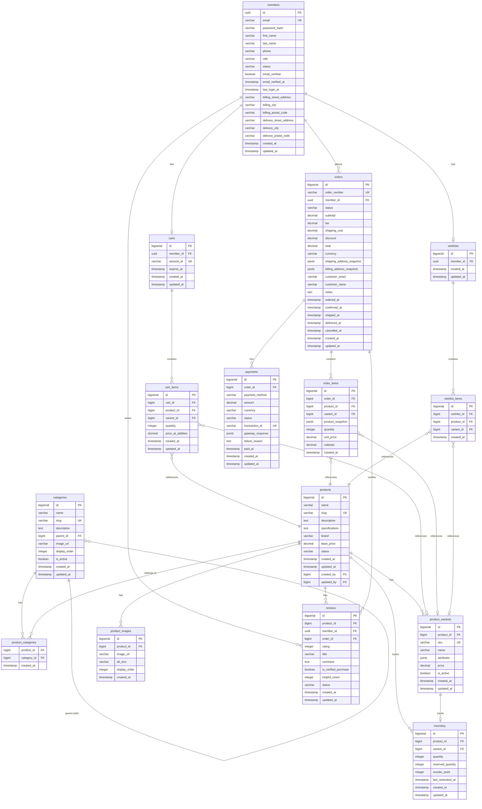
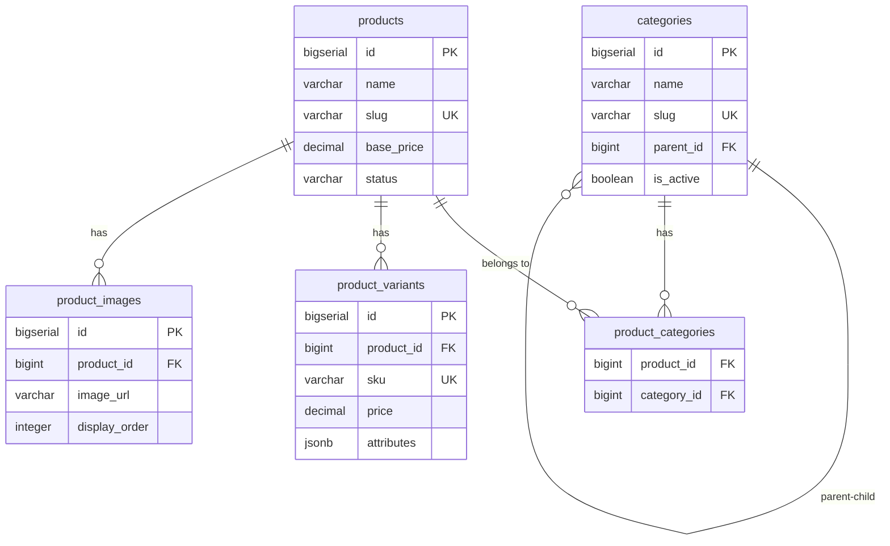
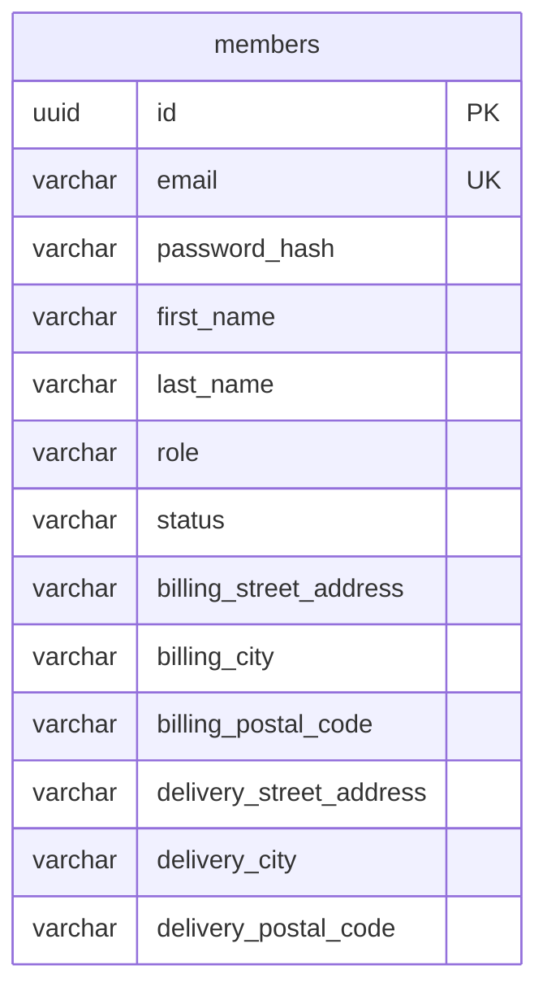
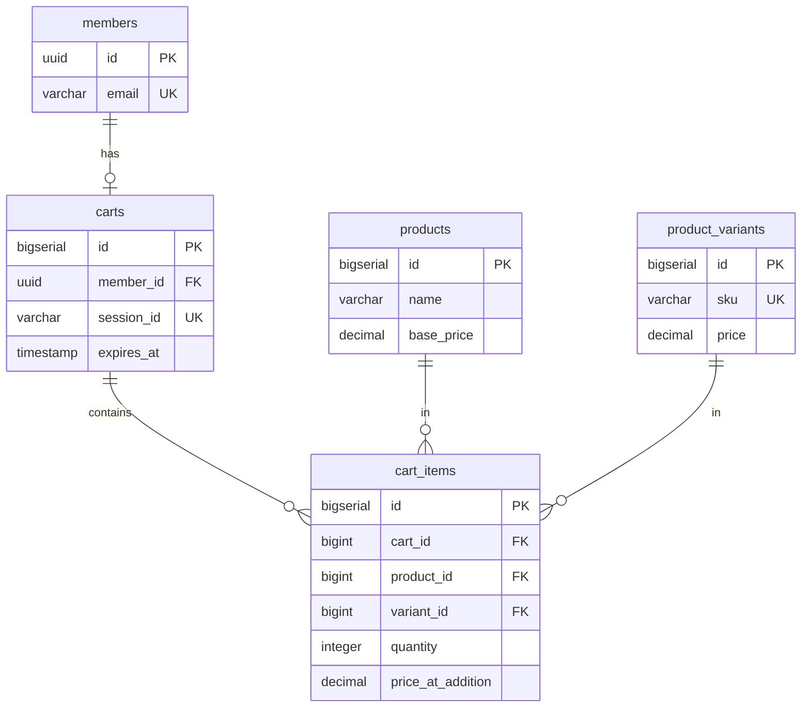
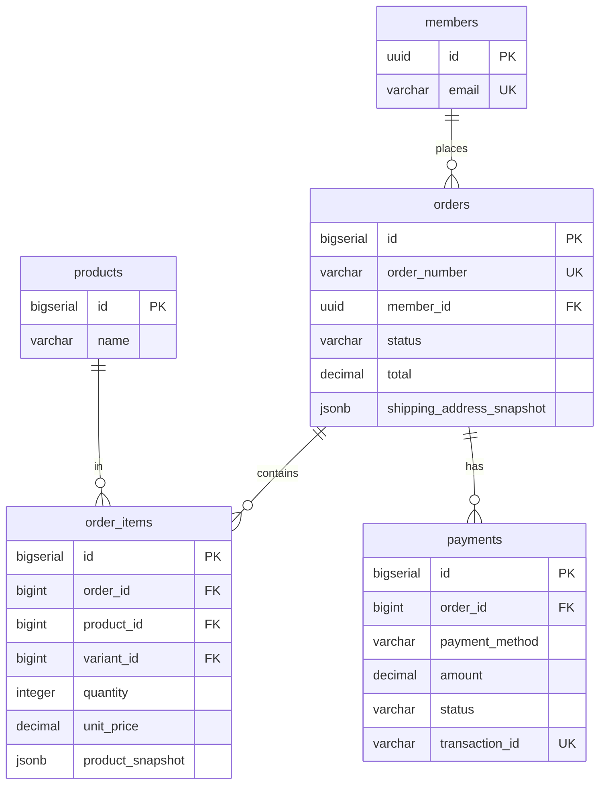
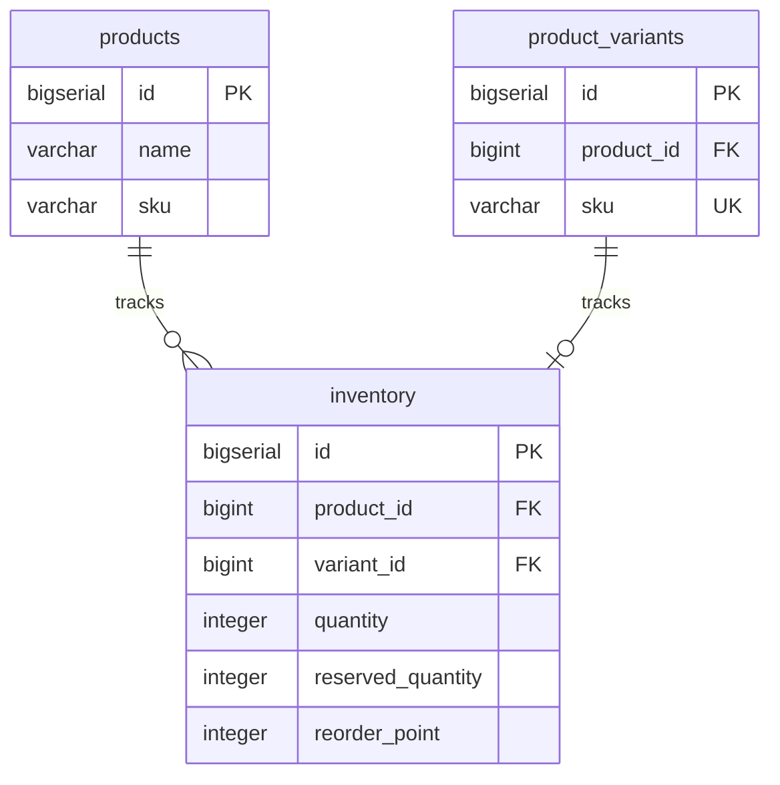

# Entity Relationship Diagram (ERD)

**Project:** E-Commerce Platform
**Last Updated:** 2025-10-21
**Design Pattern:** Domain-Driven Design with Value Objects

---

## Design Notes

### Address as Value Object
Addresses are implemented as **embedded Value Objects** using JPA `@Embeddable`:
- **Members table**: Contains embedded `billingAddress` and `deliveryAddress` fields
- **Orders table**: Contains JSONB snapshots of addresses at order time
- **No separate addresses table**: Addresses have no identity, only attributes
- **Benefits**: Simpler schema, true DDD Value Object pattern, type-safe access

---

## Phase 1 - Complete ERD



---

## Simplified ERD by Domain Context

### Product Catalog Context Only



### Member & Auth Context Only



**Note:** Billing and delivery addresses are embedded as Value Objects (no separate table).

### Shopping Cart Context Only



### Order Management Context Only



### Inventory Context Only



---

## Relationship Cardinality Legend

- `||--o{` : One to Many (one-to-zero-or-more)
- `||--||` : One to One
- `}o--||` : Many to One
- `}o--o{` : Many to Many
- `||--o|` : One to Zero-or-One

---

## Key Relationships Explained

### Product Catalog
1. **Category → Category** (Self-referencing)
   - Hierarchical structure for nested categories
   - One parent category can have many child categories

2. **Product ↔ Category** (Many-to-Many)
   - Through `product_categories` junction table
   - One product can belong to multiple categories

3. **Product → ProductVariant** (One-to-Many)
   - One product can have multiple variants (sizes, colors)
   - Each variant has unique SKU

4. **Product → ProductImage** (One-to-Many)
   - One product can have multiple images
   - Ordered by `display_order`

### Member Management
1. **Member Embedded Addresses** (Value Objects)
   - Billing address embedded directly in members table
   - Delivery address embedded directly in members table
   - No separate addresses table - true Value Object pattern
   - Nullable fields (members may not have addresses initially)

### Shopping Cart
1. **Member → Cart** (One-to-One)
   - Each logged-in member has one active cart
   - Guest carts use `session_id`

2. **Cart → CartItem** (One-to-Many)
   - One cart contains multiple items

3. **CartItem → Product/Variant** (Many-to-One)
   - Each cart item references one product
   - Optional variant reference

### Order Management
1. **Member → Order** (One-to-Many)
   - One member can place multiple orders
   - Guest orders have `member_id` NULL

2. **Order → OrderItem** (One-to-Many)
   - One order contains multiple items

3. **Order → Payment** (One-to-Many)
   - One order can have multiple payments (retries, partial payments)

4. **OrderItem → Product** (Many-to-One)
   - Snapshot stored in `product_snapshot` (immutable)

### Inventory
1. **Product/Variant → Inventory** (One-to-One)
   - Each product or variant has one inventory record
   - Tracks quantity and reserved stock

### Reviews (Phase 2)
1. **Product → Review** (One-to-Many)
   - One product can have many reviews

2. **Member → Review** (One-to-Many)
   - One member can write many reviews (one per product)

3. **Order → Review** (One-to-Many)
   - Verified purchase linking

### Wishlist (Phase 2)
1. **Member → Wishlist** (One-to-One)
   - One member has one wishlist

2. **Wishlist → WishlistItem** (One-to-Many)
   - One wishlist contains multiple items

---

## Database Constraints

### Primary Keys
- Most tables have `id BIGSERIAL PRIMARY KEY`
- `members` table uses `id UUID PRIMARY KEY`

### Foreign Keys
- `ON DELETE RESTRICT` (default) - prevents deletion
- `ON DELETE CASCADE` for:
  - `cart_items.cart_id`
  - Dependent entities

### Unique Constraints
- `products.slug`
- `categories.slug`
- `members.email`
- `orders.order_number`
- `product_variants.sku`
- `carts.member_id`
- `carts.session_id`
- `payments.transaction_id`

### Composite Unique Constraints
- `product_categories(product_id, category_id)`
- `cart_items(cart_id, product_id, variant_id)`
- `inventory(product_id, variant_id)`
- `reviews(product_id, member_id)`
- `wishlist_items(wishlist_id, product_id, variant_id)`

### Check Constraints
- All monetary amounts: `>= 0`
- Quantities: `> 0`
- `reviews.rating`: `BETWEEN 1 AND 5`

---

## How to View This ERD

### In GitHub/GitLab
The Mermaid diagrams will render automatically in markdown preview.

### In VS Code
Install the "Markdown Preview Mermaid Support" extension.

### Online
Copy the mermaid code blocks to: https://mermaid.live/

---

## Implementation Details

### Enums

#### MemberRole
```kotlin
enum class MemberRole {
    ADMIN,
    CUSTOMER,
    SELLER
}
```

#### MemberStatus
```kotlin
enum class MemberStatus {
    ACTIVE,
    INACTIVE,
    PENDING
}
```

### Value Objects

#### Address Value Object
**Implementation:** JPA `@Embeddable`

```kotlin
@Embeddable
data class Address(
    val streetAddress: String,
    val city: String,
    val postalCode: String
)
```

**Usage in Member Entity:**
```kotlin
@Entity
class Member(
    @Embedded
    @AttributeOverrides(
        AttributeOverride(name = "streetAddress", column = Column(name = "billing_street_address")),
        AttributeOverride(name = "city", column = Column(name = "billing_city")),
        AttributeOverride(name = "postalCode", column = Column(name = "billing_postal_code"))
    )
    val billingAddress: Address?,

    @Embedded
    @AttributeOverrides(
        AttributeOverride(name = "streetAddress", column = Column(name = "delivery_street_address")),
        AttributeOverride(name = "city", column = Column(name = "delivery_city")),
        AttributeOverride(name = "postalCode", column = Column(name = "delivery_postal_code"))
    )
    val deliveryAddress: Address?
) : BaseEntity()
```

### Base Entity

**BaseEntity** - Mapped superclass for audit fields:
```kotlin
@MappedSuperclass
abstract class BaseEntity(
    @Column(nullable = false, name = "created_at", updatable = false)
    val createdAt: LocalDateTime = LocalDateTime.now(),

    @Column(nullable = false, name = "updated_at")
    var updatedAt: LocalDateTime = LocalDateTime.now()
) {
    @PreUpdate
    fun onPreUpdate() {
        updatedAt = LocalDateTime.now()
    }
}
```

**Orders table:**
- Addresses stored as JSONB snapshots (immutable order history)

---

## Next Steps

1. Review the ERD - does it match your understanding?
2. Identify which context to implement first (recommendation: Product Catalog)
3. Create Flyway migration scripts based on this schema
4. Create JPA entities mapping to these tables

**Questions?**
- Any relationships unclear?
- Missing any tables or fields?
- Ready to start creating the Flyway migrations?
