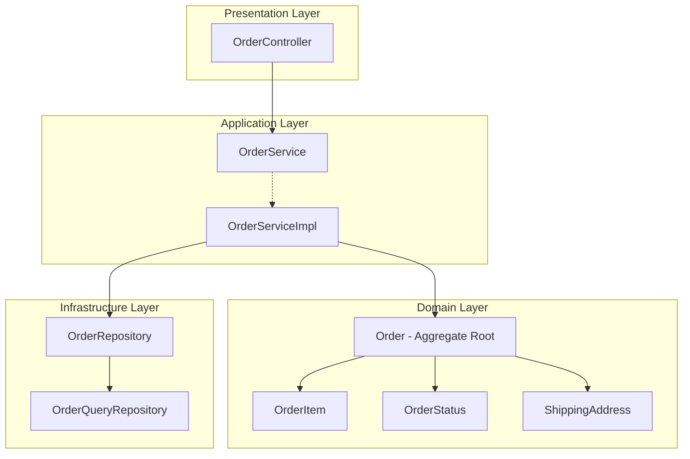
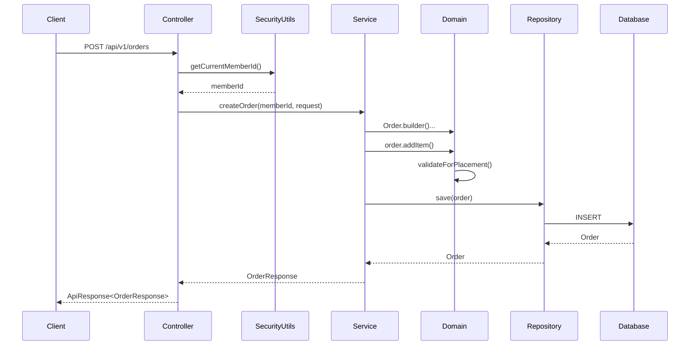
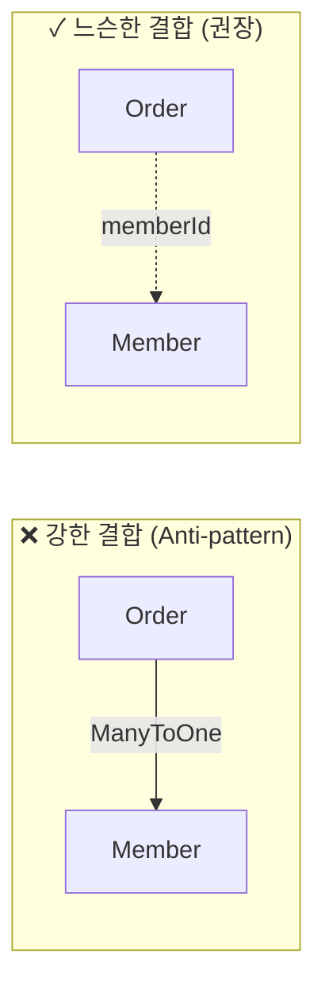
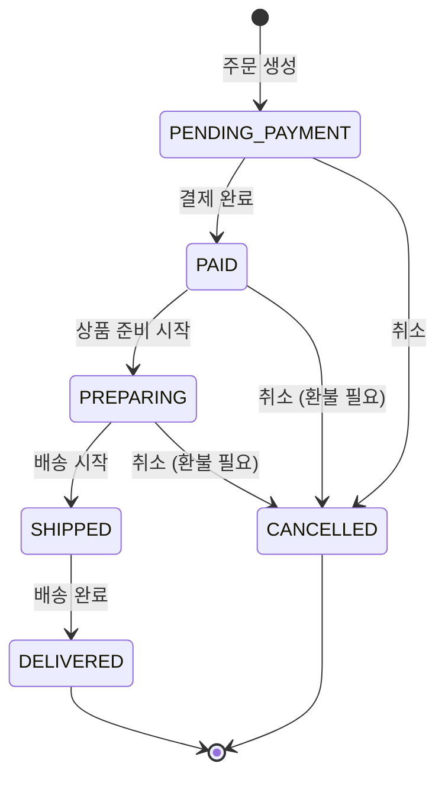
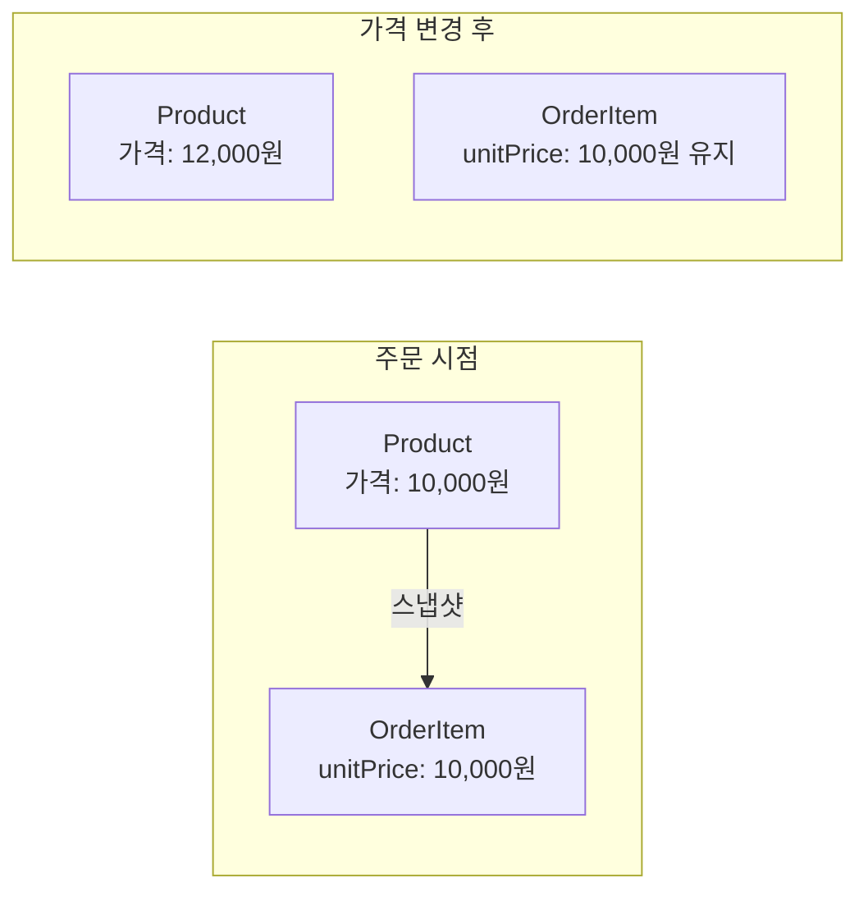
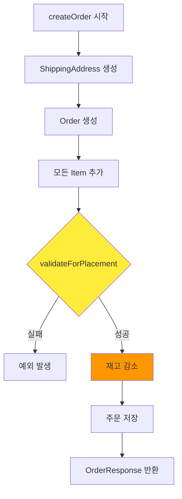
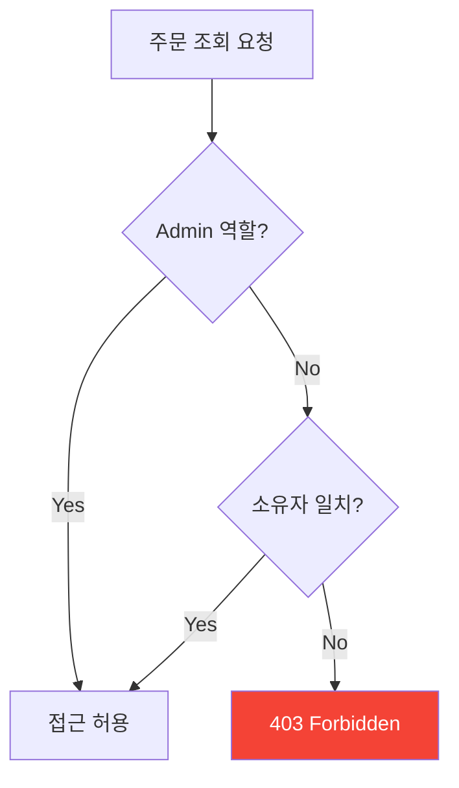
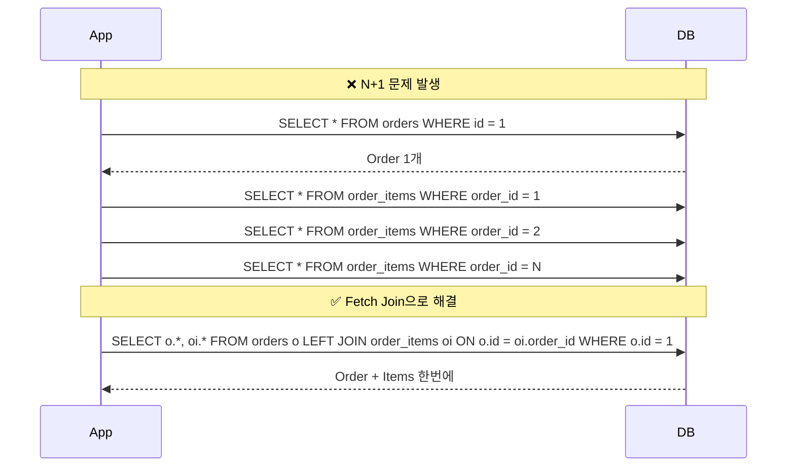
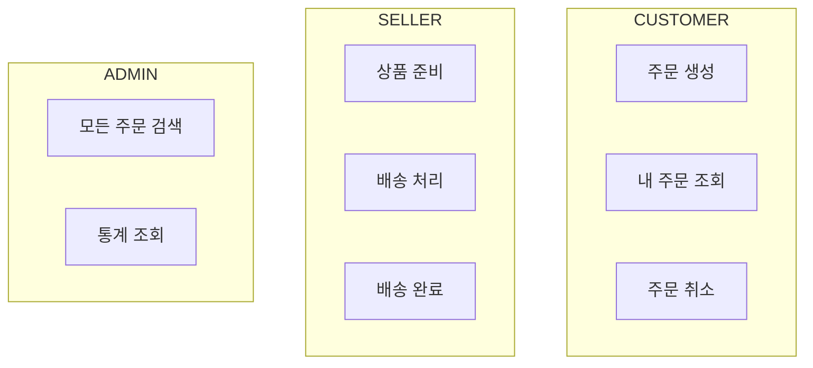
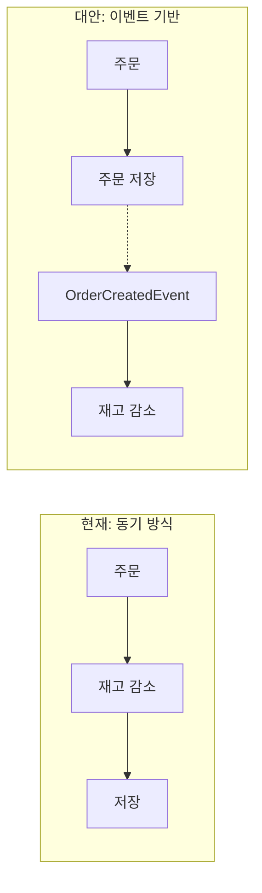

# Order 도메인 분석 가이드

> 📚 **대상**: 인턴 엔지니어
> 🎯 **목표**: Order 도메인의 설계 원칙과 구현 패턴 이해
> 📅 **작성일**: 2025-12-28

---

## 1. 아키텍처 개요

### 1.1 레이어 구조



### 1.2 요청 흐름



---

## 2. 도메인 모델 분석

### 2.1 Order - Aggregate Root

> **📁 파일 위치**: `src/main/java/platform/ecommerce/domain/order/Order.java`

#### 🔑 핵심 개념: Aggregate Root

**Aggregate Root**는 DDD(Domain-Driven Design)의 핵심 패턴입니다:

```
┌─────────────────────────────────────────────────────────────┐
│                     Order (Aggregate Root)                   │
│  ┌─────────────┐  ┌─────────────┐  ┌─────────────────────┐  │
│  │ OrderItem 1 │  │ OrderItem 2 │  │ ShippingAddress     │  │
│  │             │  │             │  │ (Value Object)      │  │
│  └─────────────┘  └─────────────┘  └─────────────────────┘  │
│                                                              │
│  ✓ 외부에서 OrderItem에 직접 접근 불가                       │
│  ✓ 모든 변경은 Order를 통해서만 가능                         │
│  ✓ 트랜잭션 일관성 경계                                      │
└─────────────────────────────────────────────────────────────┘
```

#### 엔티티 필드 분석

| 라인 | 필드 | 타입 | 설명 | 설계 의도 |
|------|------|------|------|-----------|
| 25-26 | orderNumber | String | 주문 번호 | UUID 기반 고유 식별자 (사용자 친화적) |
| 28-29 | memberId | Long | 회원 ID | FK 대신 ID 참조 (Aggregate 간 느슨한 결합) |
| 31-33 | status | OrderStatus | 주문 상태 | Enum으로 상태 전이 제어 |
| 35-36 | shippingAddress | ShippingAddress | 배송지 | @Embedded Value Object |
| 72-73 | items | List<OrderItem> | 주문 항목 | orphanRemoval=true로 생명주기 관리 |

```java
// Order.java:25-29 - 식별자 전략
@Column(name = "order_number", nullable = false, unique = true, length = 50)
private String orderNumber;  // 사용자에게 노출되는 주문번호

@Column(name = "member_id", nullable = false)
private Long memberId;  // FK 대신 ID만 저장 (Aggregate 분리)
```

#### 💡 이론: 왜 Member 엔티티 대신 memberId만 저장하는가?



**장점**:
1. **독립적인 배포**: Order 서비스와 Member 서비스를 분리 가능
2. **성능**: 불필요한 JOIN 방지
3. **확장성**: 마이크로서비스로 전환 시 용이

**단점**:
- 참조 무결성을 애플리케이션 레벨에서 관리해야 함

---

### 2.2 상태 전이 (State Machine)

> **📁 파일 위치**: `src/main/java/platform/ecommerce/domain/order/OrderStatus.java`



#### 상태 전이 로직 (OrderStatus.java:24-31)

```java
public boolean canTransitionTo(OrderStatus next) {
    return switch (this) {
        case PENDING_PAYMENT -> next == PAID || next == CANCELLED;
        case PAID -> next == PREPARING || next == CANCELLED;
        case PREPARING -> next == SHIPPED || next == CANCELLED;
        case SHIPPED -> next == DELIVERED;  // ⚠️ 배송 후 취소 불가
        case DELIVERED, CANCELLED -> false;  // 최종 상태
    };
}
```

#### 💡 이론: State Pattern vs Enum

| 접근 방식 | 장점 | 단점 | 사용 시점 |
|-----------|------|------|-----------|
| **Enum (현재 구현)** | 간단, 타입 안전 | 상태별 행동 분리 어려움 | 상태가 5-6개 이하 |
| **State Pattern** | OCP 준수, 확장 용이 | 복잡성 증가 | 상태별 행동이 크게 다를 때 |

**현재 코드 분석** (Order.java:145-151):
```java
public void markAsPaid(PaymentMethod paymentMethod, String transactionId) {
    validateTransition(OrderStatus.PAID);  // 상태 전이 검증
    this.status = OrderStatus.PAID;
    this.paymentMethod = paymentMethod;
    this.paymentTransactionId = transactionId;
    this.paidAt = LocalDateTime.now();  // 이벤트 시간 기록
}
```

---

### 2.3 OrderItem - 가격 스냅샷

> **📁 파일 위치**: `src/main/java/platform/ecommerce/domain/order/OrderItem.java`

#### 핵심 설계: Price Snapshot Pattern



```java
// OrderItem.java:29-36 - 가격 스냅샷 필드
@Column(name = "product_name", nullable = false, length = 200)
private String productName;  // 상품명 스냅샷

@Column(name = "unit_price", nullable = false, precision = 12, scale = 2)
private BigDecimal unitPrice;  // 주문 당시 가격 (불변)
```

#### 왜 Product 참조가 아닌 스냅샷인가?

| 항목 | Product 참조 | 스냅샷 (현재) |
|------|-------------|--------------|
| 가격 추적 | 현재 가격만 조회 가능 | 주문 당시 가격 보존 |
| 상품 삭제 | 주문 데이터 손상 | 독립적으로 유지 |
| JOIN 비용 | 조회마다 JOIN | 단일 테이블 조회 |
| 저장 공간 | 작음 | 중복 저장 |

---

## 3. 서비스 레이어 분석

> **📁 파일 위치**: `src/main/java/platform/ecommerce/service/order/OrderServiceImpl.java`

### 3.1 주문 생성 플로우



#### 코드 분석 (OrderServiceImpl.java:38-84)

```java
@Override
@Transactional  // 트랜잭션 경계
public OrderResponse createOrder(Long memberId, OrderCreateRequest request) {
    log.info("Creating order for member: {}", memberId);

    // 1. Value Object 생성
    ShippingAddress shippingAddress = ShippingAddress.builder()...

    // 2. Aggregate Root 생성
    Order order = Order.builder()
            .memberId(memberId)
            .shippingAddress(shippingAddress)
            ...
            .build();

    // 3. 아이템 추가 (부수 효과 없음)
    for (OrderItemRequest itemRequest : request.items()) {
        order.addItem(...);  // Line 58-66
    }

    // 4. 검증 (재고 감소 전!)
    order.validateForPlacement();  // Line 69 - 핵심 보안 수정

    // 5. 재고 감소 (검증 후에만 실행)
    for (OrderItemRequest itemRequest : request.items()) {
        productService.decreaseStock(...);  // Line 72-78
    }

    // 6. 저장 및 반환
    Order savedOrder = orderRepository.save(order);
    return toResponse(savedOrder);
}
```

### 3.2 소유권 검증 패턴

> **🔒 보안 관점**: 다른 사용자의 주문 접근 방지

```java
// OrderServiceImpl.java:213-225
private void validateOrderOwnership(Order order, Long memberId) {
    if (!order.getMemberId().equals(memberId)) {
        throw new InvalidStateException(ErrorCode.FORBIDDEN,
            "Not authorized to access this order");
    }
}

private void validateOrderOwnershipOrAdmin(Order order, Long memberId) {
    if (SecurityUtils.hasRole("ADMIN")) {
        return;  // Admin은 모든 주문 접근 가능
    }
    validateOrderOwnership(order, memberId);
}
```



---

## 4. Repository 패턴 분석

> **📁 파일 위치**: `src/main/java/platform/ecommerce/repository/order/OrderRepository.java`

### 4.1 N+1 문제 해결

```java
// OrderRepository.java:25-26 - Fetch Join
@Query("SELECT o FROM Order o LEFT JOIN FETCH o.items WHERE o.id = :id")
Optional<Order> findByIdWithItems(@Param("id") Long id);
```

#### N+1 문제란?



### 4.2 통계 쿼리 패턴

```java
// OrderRepository.java:35-36 - 집계 쿼리
@Query("SELECT COALESCE(SUM(o.totalAmount), 0) FROM Order o " +
       "WHERE o.createdAt BETWEEN :from AND :to AND o.status != 'CANCELLED'")
BigDecimal sumTotalAmountBetween(...);
```

**COALESCE 사용 이유**: NULL 방지 (결과 없을 때 0 반환)

---

## 5. Controller 레이어 분석

> **📁 파일 위치**: `src/main/java/platform/ecommerce/controller/OrderController.java`

### 5.1 인증/인가 패턴

```java
// OrderController.java:36-46
@Operation(summary = "Create order", description = "Create a new order")
@PostMapping
@ResponseStatus(HttpStatus.CREATED)
@PreAuthorize("isAuthenticated()")  // 인증된 사용자만
public ApiResponse<OrderResponse> createOrder(
        @Valid @RequestBody OrderCreateRequest request
) {
    Long memberId = SecurityUtils.getCurrentMemberId();  // JWT에서 추출
    OrderResponse response = orderService.createOrder(memberId, request);
    return ApiResponse.created(response);
}
```

### 5.2 역할 기반 접근 제어



| 엔드포인트 | 역할 | 라인 |
|-----------|------|------|
| `POST /api/v1/orders` | 인증된 사용자 | 39 |
| `GET /api/v1/orders/{id}` | 소유자 or ADMIN | 50 |
| `POST /{id}/prepare` | SELLER, ADMIN | 116 |
| `GET /api/v1/orders` (검색) | ADMIN | 83 |

---

## 6. 트레이드오프 및 대안

### 6.1 현재 설계의 트레이드오프

| 설계 결정 | 복잡도 | 가치 | 평가 |
|-----------|--------|------|------|
| Aggregate Root | 낮음 | 높음 | ✅ 필수 |
| Price Snapshot | 낮음 | 높음 | ✅ 필수 |
| State Machine | 중간 | 높음 | ✅ 필수 |
| ID 참조 (느슨한 결합) | 낮음 | 중간 | ✅ 권장 |
| Fetch Join | 중간 | 중간 | ✅ 권장 |

### 6.2 대안 비교

#### A. 이벤트 소싱 vs 현재 방식 (상태 저장)

| 항목 | 상태 저장 (현재) | 이벤트 소싱 |
|------|-----------------|-------------|
| 구현 복잡도 | 낮음 | 높음 |
| 이력 추적 | 별도 구현 필요 | 자동 |
| 쿼리 성능 | 빠름 | CQRS 필요 |
| 적합한 경우 | 단순 CRUD | 감사 추적 필수 |

#### B. 동기 vs 비동기 재고 감소



| 방식 | 장점 | 단점 |
|------|------|------|
| 동기 (현재) | 단순, 일관성 보장 | 트랜잭션 길어짐 |
| 이벤트 기반 | 느슨한 결합, 확장성 | 최종 일관성, 복잡성 |

---

## 7. 핵심 체크포인트

### ✅ 이해도 점검

1. **Aggregate Root가 왜 필요한가?**
   - 트랜잭션 일관성 경계 정의
   - 비즈니스 불변식(invariant) 보호

2. **memberId만 저장하는 이유는?**
   - Aggregate 간 느슨한 결합
   - 마이크로서비스 전환 용이

3. **가격 스냅샷의 목적은?**
   - 주문 당시 가격 보존
   - 상품 변경/삭제로부터 독립

4. **상태 전이 검증이 왜 도메인에 있는가?**
   - 비즈니스 규칙은 도메인 레이어에
   - 서비스 레이어 중복 방지

5. **재고 감소 순서가 중요한 이유는?**
   - 검증 실패 시 롤백 복잡도 감소
   - 데이터 일관성 보장

---

## 8. 연관 문서

- [Payment 분석](./02-payment-analysis.md)
- [Product 분석](./04-product-analysis.md)
- [보안 리뷰](../docs/lead-review/lead-engineer-review.md)

---

> 📝 **학습 팁**: 코드를 읽을 때 "왜 이렇게 설계했을까?"를 항상 질문하세요. 모든 설계에는 트레이드오프가 있습니다.
