# Payment 도메인 분석 가이드

> 📚 **대상**: 인턴 엔지니어
> 🎯 **목표**: 결제 시스템의 설계 패턴과 PG 연동 구조 이해
> 📅 **작성일**: 2025-12-28

---

## 1. 결제 시스템 개요

### 1.1 아키텍처 개요

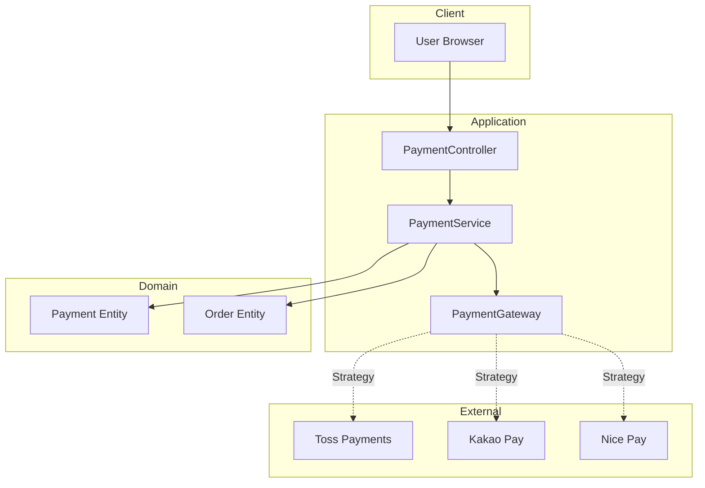

### 1.2 결제 흐름 (2단계 결제)

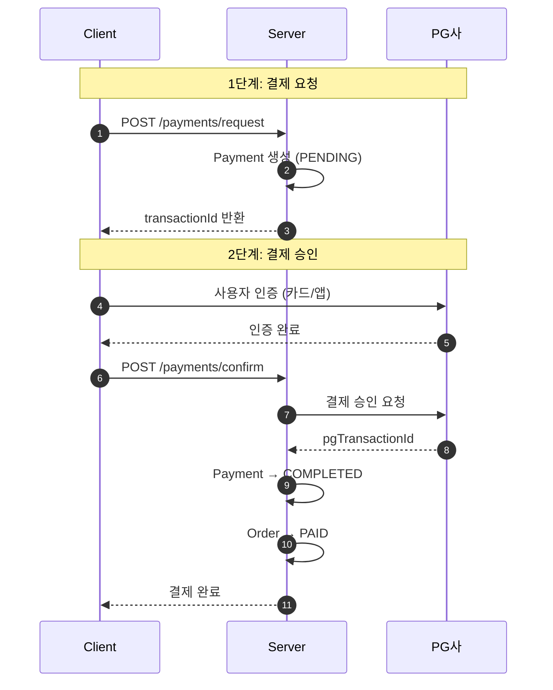

---

## 2. 도메인 모델 분석

### 2.1 Payment 엔티티

> **📁 파일 위치**: `src/main/java/platform/ecommerce/domain/payment/Payment.java`

#### 엔티티 구조

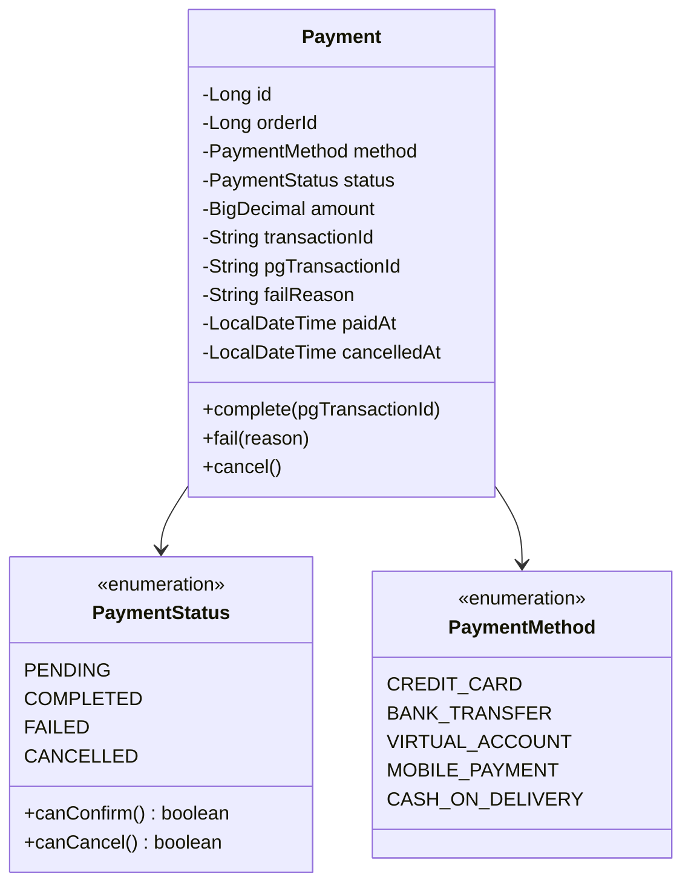

#### 필드 분석

| 라인 | 필드 | 타입 | 설명 | 설계 의도 |
|------|------|------|------|-----------|
| 23-24 | orderId | Long | 주문 ID | FK 대신 ID 참조 (Aggregate 분리) |
| 37-38 | transactionId | String | 내부 거래 ID | 우리 시스템 식별자 |
| 40-41 | pgTransactionId | String | PG사 거래 ID | 외부 시스템 연동용 |
| 43-44 | failReason | String | 실패 사유 | 디버깅 및 고객 안내용 |

```java
// Payment.java:52-59 - 생성자
@Builder
public Payment(Long orderId, PaymentMethod method, BigDecimal amount) {
    this.orderId = orderId;
    this.method = method;
    this.amount = amount;
    this.transactionId = generateTransactionId();  // PAY-{UUID}
    this.status = PaymentStatus.PENDING;  // 초기 상태
}
```

#### 💡 이론: 왜 두 개의 Transaction ID가 필요한가?

```
┌─────────────────────────────────────────────────────────────┐
│                    Transaction ID 구조                       │
├─────────────────────────────────────────────────────────────┤
│                                                              │
│  transactionId (내부)          pgTransactionId (외부)         │
│  ┌─────────────────┐          ┌─────────────────┐           │
│  │ PAY-ABC123XYZ   │   ←→    │ toss_1234567890 │           │
│  │                 │          │                 │           │
│  │ 우리 시스템     │          │ PG사 시스템     │           │
│  │ 생성 시점: 요청 │          │ 생성 시점: 승인 │           │
│  └─────────────────┘          └─────────────────┘           │
│                                                              │
│  용도:                        용도:                          │
│  - 클라이언트 전달            - 환불 시 필수                 │
│  - 내부 추적                  - PG사 문의 시 필요            │
│  - DB 조회                    - 정산 대사                    │
└─────────────────────────────────────────────────────────────┘
```

---

### 2.2 상태 전이 (PaymentStatus)

> **📁 파일 위치**: `src/main/java/platform/ecommerce/domain/payment/PaymentStatus.java`

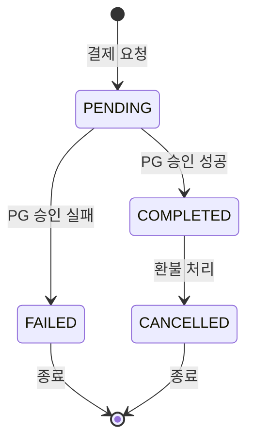

#### 상태별 전이 가능성

```java
// PaymentStatus.java:22-28
public boolean canConfirm() {
    return this == PENDING;  // PENDING에서만 승인 가능
}

public boolean canCancel() {
    return this == COMPLETED;  // COMPLETED에서만 취소(환불) 가능
}
```

| 현재 상태 | confirm() | cancel() | 비고 |
|-----------|-----------|----------|------|
| PENDING | ✅ | ❌ | 승인 대기 중 |
| COMPLETED | ❌ | ✅ | 환불만 가능 |
| FAILED | ❌ | ❌ | 최종 상태 |
| CANCELLED | ❌ | ❌ | 최종 상태 |

---

## 3. Strategy 패턴 - PG 연동

> **📁 파일 위치**: `src/main/java/platform/ecommerce/service/payment/PaymentGateway.java`

### 3.1 패턴 구조

> ⚠️ **참고**: TossPaymentGateway, KakaoPaymentGateway는 확장 예시입니다. 현재 코드베이스에는 MockPaymentGateway만 구현되어 있습니다.

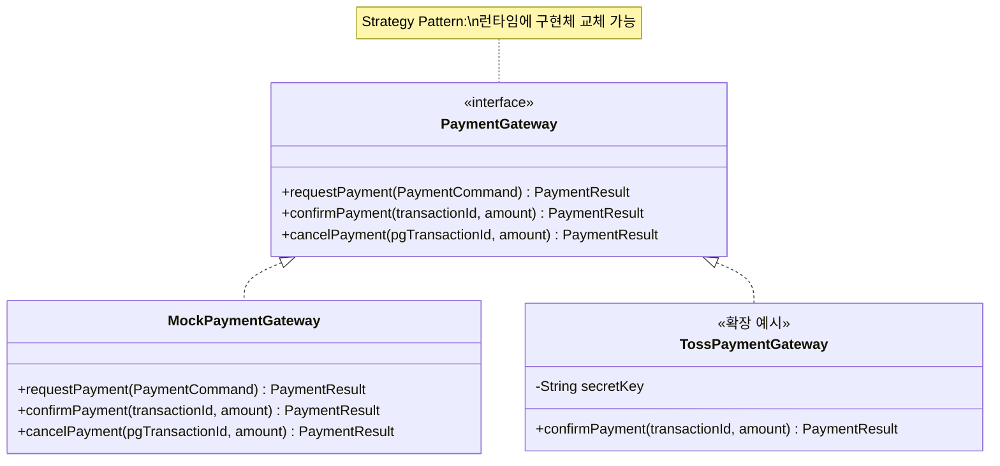

### 3.2 Strategy 패턴이란?

```
┌────────────────────────────────────────────────────────────────┐
│                    Strategy Pattern                             │
├────────────────────────────────────────────────────────────────┤
│                                                                 │
│  문제: 결제 로직이 PG사마다 다름                                 │
│                                                                 │
│  해결: 공통 인터페이스 + 다양한 구현체                           │
│                                                                 │
│  ┌─────────────┐     ┌─────────────┐     ┌─────────────┐       │
│  │   Context   │────▶│  Strategy   │◀────│  Concrete   │       │
│  │  (Service)  │     │ (Interface) │     │  Strategy   │       │
│  └─────────────┘     └─────────────┘     └─────────────┘       │
│                                                                 │
│  장점:                                                          │
│  1. OCP (Open-Closed Principle) 준수                            │
│  2. 런타임 전략 변경 가능                                        │
│  3. 테스트 용이 (Mock 주입)                                      │
│                                                                 │
└────────────────────────────────────────────────────────────────┘
```

### 3.3 PaymentResult - 결과 객체

> **📁 파일 위치**: `src/main/java/platform/ecommerce/service/payment/PaymentResult.java`

```java
// PaymentResult.java:9-27
@Builder
public record PaymentResult(
        boolean success,
        String pgTransactionId,
        String failReason
) {
    // 정적 팩토리 메서드
    public static PaymentResult success(String pgTransactionId) {
        return PaymentResult.builder()
                .success(true)
                .pgTransactionId(pgTransactionId)
                .build();
    }

    public static PaymentResult failure(String reason) {
        return PaymentResult.builder()
                .success(false)
                .failReason(reason)
                .build();
    }
}
```

#### 💡 이론: 예외 vs 결과 객체

| 접근 방식 | 장점 | 단점 | 사용 시점 |
|-----------|------|------|-----------|
| **예외 던지기** | 명확한 실패 처리 | 성능 비용, 남용 위험 | 프로그래밍 오류 |
| **결과 객체** | 예상된 실패 표현 | 호출자가 확인 필수 | 비즈니스 실패 |

```java
// ✅ 현재 구현: 결과 객체 사용
PaymentResult result = paymentGateway.confirmPayment(transactionId, amount);
if (result.success()) {
    payment.complete(result.pgTransactionId());
} else {
    payment.fail(result.failReason());
}
```

---

## 4. 서비스 레이어 분석

> **📁 파일 위치**: `src/main/java/platform/ecommerce/service/payment/PaymentServiceImpl.java`

### 4.1 결제 요청 흐름

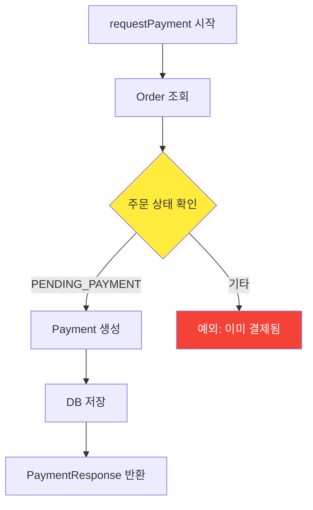

```java
// PaymentServiceImpl.java:36-53
@Override
@Transactional
public PaymentResponse requestPayment(Long orderId, PaymentMethod method) {
    log.info("Requesting payment for order: orderId={}, method={}", orderId, method);

    Order order = findOrderById(orderId);
    validateOrderForPayment(order);  // PENDING_PAYMENT 상태 검증

    Payment payment = Payment.builder()
            .orderId(orderId)
            .method(method)
            .amount(order.getTotalAmount())
            .build();

    Payment savedPayment = paymentRepository.save(payment);
    log.info("Payment created: transactionId={}", savedPayment.getTransactionId());

    return PaymentResponse.from(savedPayment);
}
```

### 4.2 결제 승인 흐름

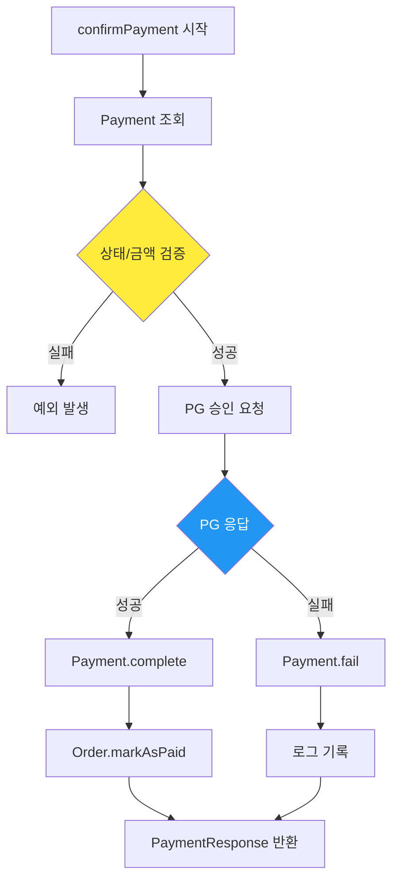

```java
// PaymentServiceImpl.java:55-80
@Override
@Transactional
public PaymentResponse confirmPayment(String transactionId, BigDecimal amount) {
    Payment payment = findPaymentByTransactionId(transactionId);
    validatePaymentForConfirm(payment, amount);  // Line 61

    // PG사 승인 요청
    PaymentResult result = paymentGateway.confirmPayment(transactionId, amount);

    if (result.success()) {
        payment.complete(result.pgTransactionId());

        // 주문 상태 업데이트
        Order order = findOrderById(payment.getOrderId());
        order.markAsPaid(payment.getMethod(), transactionId);

        log.info("Payment confirmed: transactionId={}", transactionId);
    } else {
        payment.fail(result.failReason());
        log.warn("Payment failed: transactionId={}, reason={}",
                transactionId, result.failReason());
    }

    return PaymentResponse.from(payment);
}
```

### 4.3 소유권 검증 패턴

```java
// PaymentServiceImpl.java:168-176
private void validatePaymentOwnershipOrAdmin(Payment payment, Long memberId) {
    if (SecurityUtils.hasRole("ADMIN")) {
        return;  // Admin은 모든 결제 조회 가능
    }
    Order order = findOrderById(payment.getOrderId());
    if (!order.getMemberId().equals(memberId)) {
        throw new InvalidStateException(ErrorCode.FORBIDDEN,
            "Not authorized to access this payment");
    }
}
```

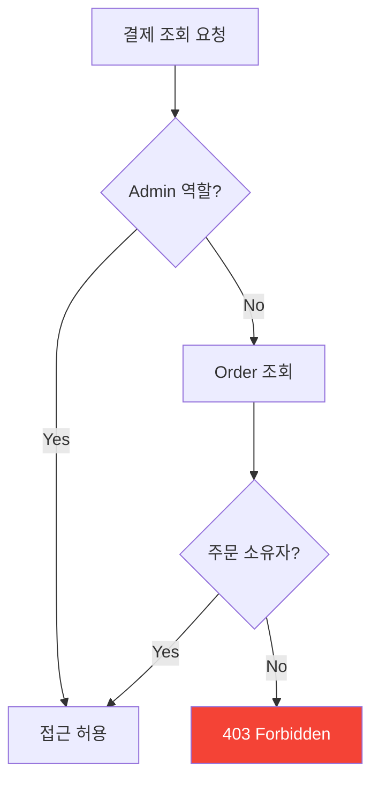

---

## 5. Controller 레이어 분석

> **📁 파일 위치**: `src/main/java/platform/ecommerce/controller/PaymentController.java`

### 5.1 API 엔드포인트

```mermaid
graph LR
    subgraph "결제 프로세스"
        A[POST /request] --> B[POST /confirm]
    end

    subgraph "결제 관리"
        C[POST /{id}/cancel]
        D[GET /{id}]
        E[GET /orders/{orderId}]
    end
```

| 엔드포인트 | 메서드 | 라인 | 역할 | 인가 |
|-----------|--------|------|------|------|
| `/request` | POST | 31-40 | 결제 요청 생성 | 인증된 사용자 |
| `/confirm` | POST | 42-53 | 결제 승인 | 인증된 사용자 |
| `/{id}/cancel` | POST | 55-64 | 결제 취소(환불) | 소유자 |
| `/{id}` | GET | 66-75 | 결제 조회 | 소유자/Admin |
| `/orders/{orderId}` | GET | 77-86 | 주문별 결제 내역 | 소유자/Admin |

### 5.2 요청/응답 DTO

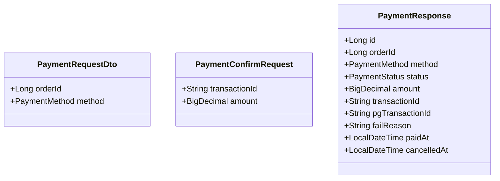

---

## 6. 보안 고려사항

### 6.1 결제 보안 체크리스트

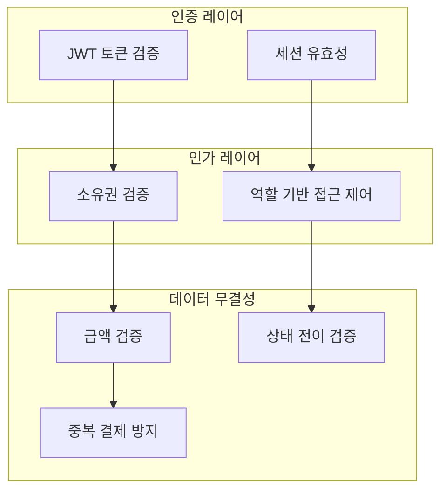

### 6.2 금액 검증 (Amount Verification)

```java
// PaymentServiceImpl.java:146-153
private void validatePaymentForConfirm(Payment payment, BigDecimal amount) {
    if (!payment.getStatus().canConfirm()) {
        throw new InvalidStateException(ErrorCode.PAYMENT_ALREADY_PROCESSED);
    }
    // ⚠️ 중요: 클라이언트가 보낸 금액과 DB 금액 비교
    if (payment.getAmount().compareTo(amount) != 0) {
        throw new InvalidStateException(ErrorCode.PAYMENT_AMOUNT_MISMATCH);
    }
}
```

**왜 중요한가?**
```
공격 시나리오:
1. 정상 요청: 상품 100,000원 → 결제 요청 → transactionId 발급
2. 조작 요청: confirm 시 amount=1,000원으로 변조
3. 방어: DB에 저장된 원래 금액(100,000원)과 비교 → 불일치 → 거부
```

---

## 7. 트레이드오프 및 대안

### 7.1 현재 설계 vs 대안

#### A. 2단계 결제 vs 1단계 결제

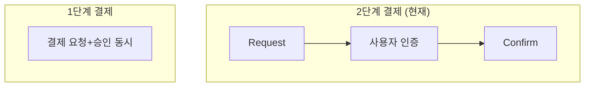

| 항목 | 2단계 (현재) | 1단계 |
|------|-------------|-------|
| 보안 | 높음 (사용자 확인) | 낮음 |
| UX | 약간 복잡 | 간단 |
| 취소 처리 | 용이 | 환불만 가능 |
| 적합한 경우 | 대부분의 결제 | 소액 자동결제 |

#### B. 동기 PG 호출 vs 비동기 처리

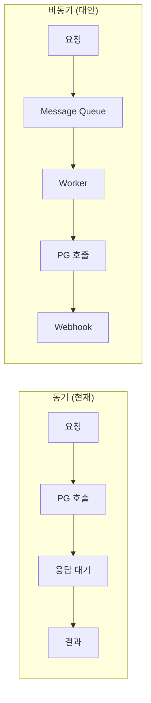

| 항목 | 동기 (현재) | 비동기 |
|------|------------|--------|
| 구현 복잡도 | 낮음 | 높음 |
| 확장성 | 제한적 | 높음 |
| 장애 대응 | 재시도 필요 | 자동 재시도 가능 |
| 적합한 트래픽 | 중소 규모 | 대규모 |

#### C. 단일 PG vs 다중 PG

```java
// 현재: 단일 PG (Strategy 패턴으로 확장 준비됨)
private final PaymentGateway paymentGateway;  // 하나만 주입

// 대안: 다중 PG 라우팅
private final Map<PaymentMethod, PaymentGateway> gateways;
```

---

## 8. 테스트 코드 분석

> **📁 파일 위치**: `src/test/java/platform/ecommerce/service/PaymentServiceTest.java`

### 8.1 테스트 구조

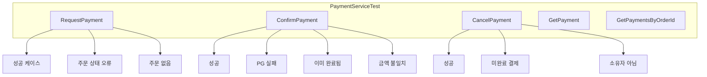

### 8.2 BDD 스타일 테스트

```java
// PaymentServiceTest.java:147-166
@Test
@DisplayName("should complete payment and update order status")
void confirmPayment_success() {
    // given - 사전 조건 설정
    String transactionId = testPayment.getTransactionId();
    given(paymentRepository.findByTransactionId(transactionId))
        .willReturn(Optional.of(testPayment));
    given(orderRepository.findById(ORDER_ID))
        .willReturn(Optional.of(testOrder));
    given(paymentGateway.confirmPayment(eq(transactionId), eq(AMOUNT)))
        .willReturn(PaymentResult.success("PG-12345678"));

    // when - 실행
    PaymentResponse response = paymentService.confirmPayment(transactionId, AMOUNT);

    // then - 검증
    assertThat(response.status()).isEqualTo(PaymentStatus.COMPLETED);
    assertThat(response.pgTransactionId()).isEqualTo("PG-12345678");
    assertThat(testOrder.getStatus()).isEqualTo(OrderStatus.PAID);
}
```

---

## 9. 핵심 체크포인트

### ✅ 이해도 점검

1. **왜 2개의 Transaction ID가 필요한가?**
   - 내부(transactionId): 우리 시스템 추적
   - 외부(pgTransactionId): PG사 환불/조회 시 필수

2. **Strategy 패턴의 이점은?**
   - PG사 교체 용이 (코드 변경 최소화)
   - 테스트 시 Mock 주입 가능

3. **2단계 결제를 사용하는 이유는?**
   - 사용자 확인 단계 추가 (보안)
   - 결제 취소 용이

4. **금액 검증이 중요한 이유는?**
   - 클라이언트 조작 방지
   - 결제 금액 무결성 보장

5. **결과 객체 vs 예외 사용 기준은?**
   - PG 실패: 예상된 비즈니스 실패 → 결과 객체
   - 시스템 오류: 예상치 못한 상황 → 예외

---

## 10. 연관 문서

- [Order 분석](./01-order-analysis.md) - 주문과 결제 연동
- [보안 리뷰](../docs/lead-review/lead-engineer-review.md) - 소유권 검증 수정 내역

---

> 📝 **학습 팁**: 결제 시스템은 "돈"이 관련된 만큼 보안과 데이터 무결성이 가장 중요합니다. 항상 "이 코드가 조작되면 어떻게 될까?"를 질문하세요.
