# Member 도메인 분석 가이드

> 📚 **대상**: 인턴 엔지니어
> 🎯 **목표**: 회원 도메인의 설계 패턴과 소프트 삭제(Soft Delete) 구현 이해
> 📅 **작성일**: 2025-12-28

---

## 1. 회원 도메인 개요

### 1.1 아키텍처 개요

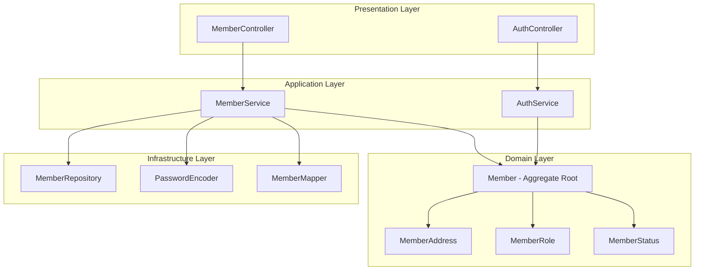

### 1.2 Member 생명주기

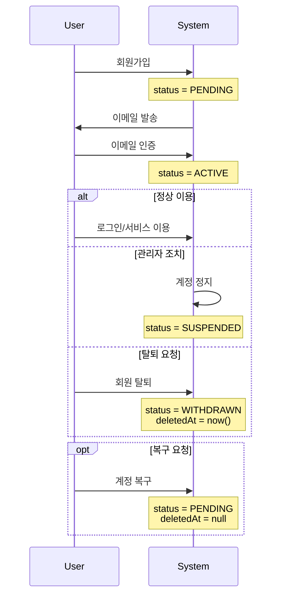

---

## 2. 도메인 모델 분석

### 2.1 Member - Aggregate Root

> **📁 파일 위치**: `src/main/java/platform/ecommerce/domain/member/Member.java`

#### 클래스 구조

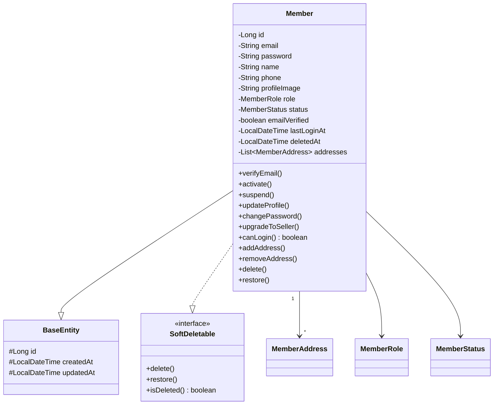

#### 필드 분석

| 라인 | 필드 | 설명 | 설계 의도 |
|------|------|------|-----------|
| 26-27 | email | 로그인 ID | unique 제약 (중복 가입 방지) |
| 29-30 | password | 암호화된 비밀번호 | BCrypt 인코딩 |
| 41-43 | role | 회원 역할 | RBAC 구현 |
| 45-47 | status | 계정 상태 | 상태 기반 로직 |
| 55-56 | deletedAt | 삭제 시간 | Soft Delete 구현 |
| 58-59 | addresses | 배송지 목록 | 최대 10개 제한 |

#### 💡 이론: Aggregate Root 패턴

```
┌─────────────────────────────────────────────────────────────┐
│                 Member Aggregate                             │
├─────────────────────────────────────────────────────────────┤
│                                                              │
│  ┌───────────────┐                                          │
│  │    Member     │ ← Aggregate Root (유일한 진입점)          │
│  │  (Aggregate   │                                          │
│  │    Root)      │                                          │
│  └───────┬───────┘                                          │
│          │                                                   │
│          │ owns                                              │
│          ▼                                                   │
│  ┌───────────────┐                                          │
│  │ MemberAddress │ ← 내부 Entity (외부 접근 불가)            │
│  │     [1..10]   │                                          │
│  └───────────────┘                                          │
│                                                              │
│  규칙:                                                       │
│  1. MemberAddress는 Member를 통해서만 생성/수정/삭제         │
│  2. Repository는 Member만 존재                              │
│  3. 트랜잭션 = Aggregate 단위                               │
│                                                              │
└─────────────────────────────────────────────────────────────┘
```

---

### 2.2 상태 전이 (MemberStatus)

> **📁 파일 위치**: `src/main/java/platform/ecommerce/domain/member/MemberStatus.java`

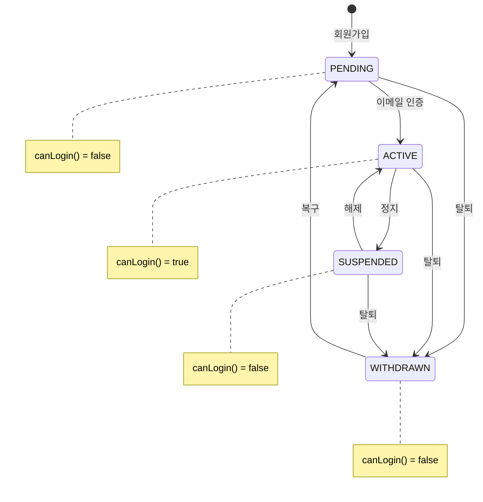

#### 상태별 권한

```java
// MemberStatus.java:20-22
public boolean canLogin() {
    return this == ACTIVE;  // ACTIVE만 로그인 가능
}
```

| 상태 | 로그인 | 주문 | 리뷰 작성 | 복구 가능 |
|------|--------|------|----------|----------|
| PENDING | ❌ | ❌ | ❌ | - |
| ACTIVE | ✅ | ✅ | ✅ | - |
| SUSPENDED | ❌ | ❌ | ❌ | Admin만 |
| WITHDRAWN | ❌ | ❌ | ❌ | ✅ (본인) |

---

### 2.3 역할 기반 접근 제어 (RBAC)

> **📁 파일 위치**: `src/main/java/platform/ecommerce/domain/member/MemberRole.java`

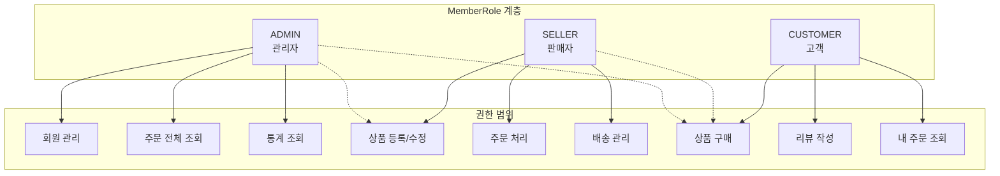

#### 역할 전환 규칙

```java
// Member.java:154-159 - 역할 업그레이드
public void upgradeToSeller() {
    if (this.role == MemberRole.ADMIN) {
        throw new InvalidStateException(ErrorCode.INVALID_INPUT,
            "Admin cannot become seller");  // Admin은 다운그레이드 불가
    }
    this.role = MemberRole.SELLER;
}
```

---

### 2.4 Soft Delete 패턴

> **📁 파일 위치**: `src/main/java/platform/ecommerce/domain/common/SoftDeletable.java`

#### 패턴 구조

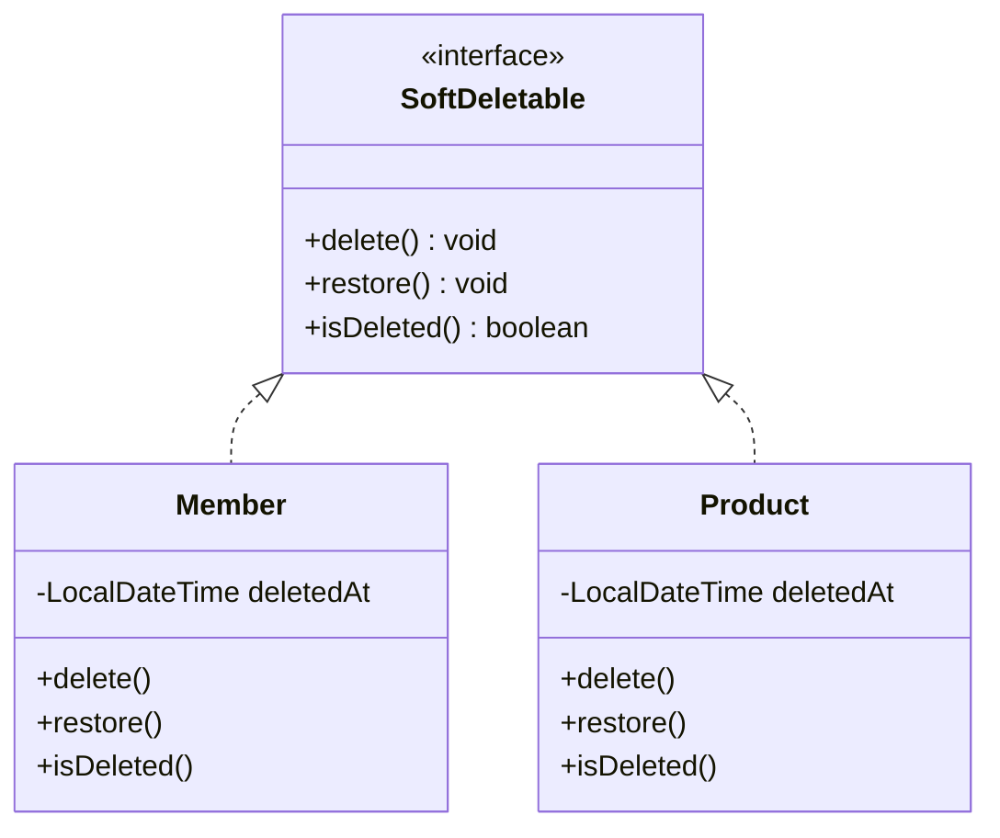

#### 구현 분석 (Member.java:263-276)

```java
@Override
public void delete() {
    this.status = MemberStatus.WITHDRAWN;
    this.deletedAt = LocalDateTime.now();  // 삭제 시간 기록
}

@Override
public void restore() {
    if (this.status != MemberStatus.WITHDRAWN) {
        throw new InvalidStateException(ErrorCode.INVALID_INPUT,
            "Member is not withdrawn");  // 탈퇴 상태만 복구 가능
    }
    this.status = MemberStatus.PENDING;  // 이메일 재인증 필요
    this.deletedAt = null;
}
```

#### 💡 이론: Hard Delete vs Soft Delete

| 항목 | Hard Delete | Soft Delete (현재) |
|------|-------------|-------------------|
| SQL | `DELETE FROM member` | `UPDATE member SET deleted_at = NOW()` |
| 복구 | 불가능 | 가능 |
| 외래 키 | 연쇄 삭제/오류 | 관계 유지 |
| 데이터 보존 | 영구 삭제 | 이력 보존 |
| 저장 공간 | 절약 | 점진적 증가 |
| 쿼리 복잡도 | 단순 | `WHERE deleted_at IS NULL` 필요 |

**사용 시점 가이드:**
- **Soft Delete 권장**: 회원, 주문, 결제 (법적 보존 의무)
- **Hard Delete 권장**: 로그, 세션, 임시 데이터

---

### 2.5 MemberAddress - 내부 엔티티

> **📁 파일 위치**: `src/main/java/platform/ecommerce/domain/member/MemberAddress.java`

#### 캡슐화 설계

```java
// MemberAddress.java:72-74 - Package-Private 접근 제어
void setDefault(boolean isDefault) {  // ⚠️ public이 아님!
    this.isDefault = isDefault;
}
```

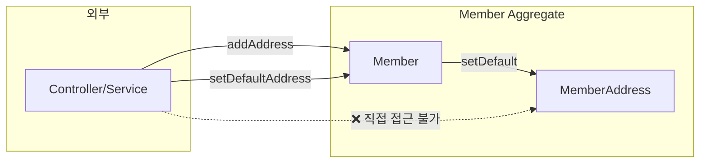

**왜 package-private인가?**
1. **불변식 보호**: 기본 배송지는 항상 1개만 존재해야 함
2. **비즈니스 규칙**: Member.setDefaultAddress()가 다른 주소의 default를 해제
3. **캡슐화**: 외부에서 직접 수정 시 불변식 깨질 수 있음

#### 주소 추가 로직 (Member.java:176-203)

```java
public MemberAddress addAddress(..., boolean isDefault) {
    // 1. 최대 개수 검증
    if (this.addresses.size() >= MAX_ADDRESS_COUNT) {  // Line 178
        throw new InvalidStateException(ErrorCode.MEMBER_ADDRESS_LIMIT_EXCEEDED);
    }

    // 2. 기본 주소 처리
    if (isDefault) {
        this.addresses.forEach(a -> a.setDefault(false));  // 기존 기본 해제
    }

    // 3. 첫 주소는 자동으로 기본
    boolean shouldBeDefault = isDefault || this.addresses.isEmpty();  // Line 188

    // 4. 생성 및 추가
    MemberAddress memberAddress = MemberAddress.builder()
            .member(this)
            ...
            .isDefault(shouldBeDefault)
            .build();

    this.addresses.add(memberAddress);
    return memberAddress;
}
```

---

## 3. 서비스 레이어 분석

> **📁 파일 위치**: `src/main/java/platform/ecommerce/service/MemberServiceImpl.java`

### 3.1 회원가입 흐름

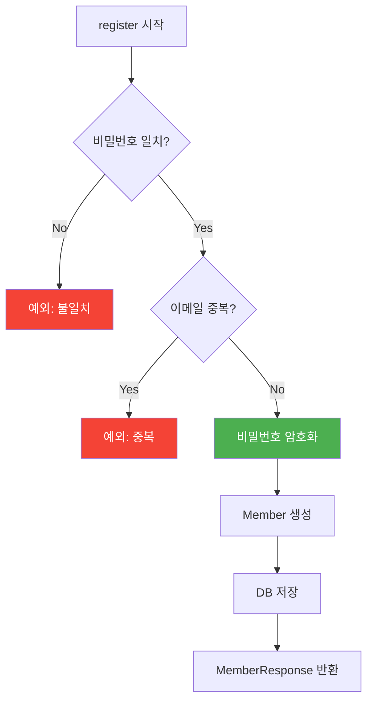

```java
// MemberServiceImpl.java:34-53
@Override
@Transactional
public MemberResponse register(MemberCreateRequest request) {
    log.info("Registering new member with email: {}", request.email());

    validatePasswordMatch(request);      // Line 39 - 비밀번호 확인
    validateEmailNotExists(request.email());  // Line 40 - 중복 검증

    Member member = Member.builder()
            .email(request.email())
            .password(passwordEncoder.encode(request.password()))  // BCrypt!
            .name(request.name())
            .phone(request.phone())
            .build();

    Member savedMember = memberRepository.save(member);
    return memberMapper.toResponse(savedMember);
}
```

### 3.2 비밀번호 변경 흐름

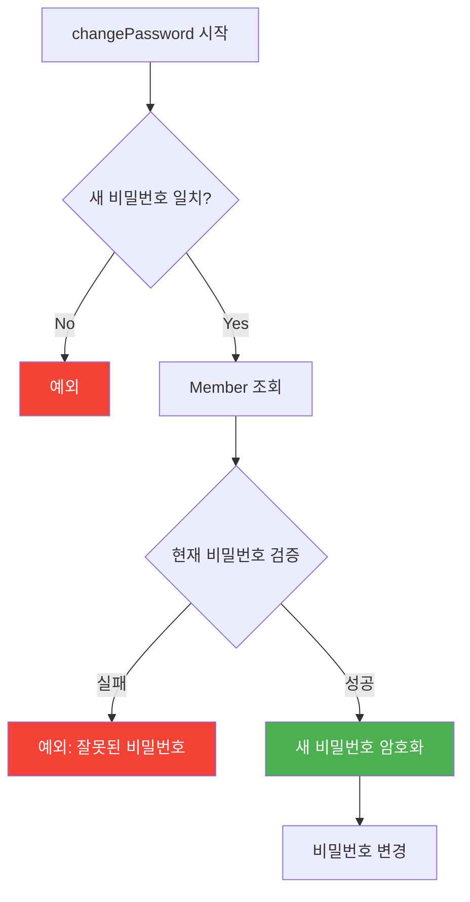

```java
// MemberServiceImpl.java:85-97
@Override
@Transactional
public void changePassword(Long memberId, PasswordChangeRequest request) {
    validateNewPasswordMatch(request);  // 새 비밀번호 확인

    Member member = findMemberById(memberId);
    validateCurrentPassword(member, request.currentPassword());  // 현재 비밀번호 검증

    member.changePassword(passwordEncoder.encode(request.newPassword()));
}

// Line 209-213 - 현재 비밀번호 검증
private void validateCurrentPassword(Member member, String rawPassword) {
    if (!passwordEncoder.matches(rawPassword, member.getPassword())) {
        throw new InvalidStateException(ErrorCode.INVALID_INPUT,
            "Current password is incorrect");
    }
}
```

### 3.3 MapStruct Mapper 활용

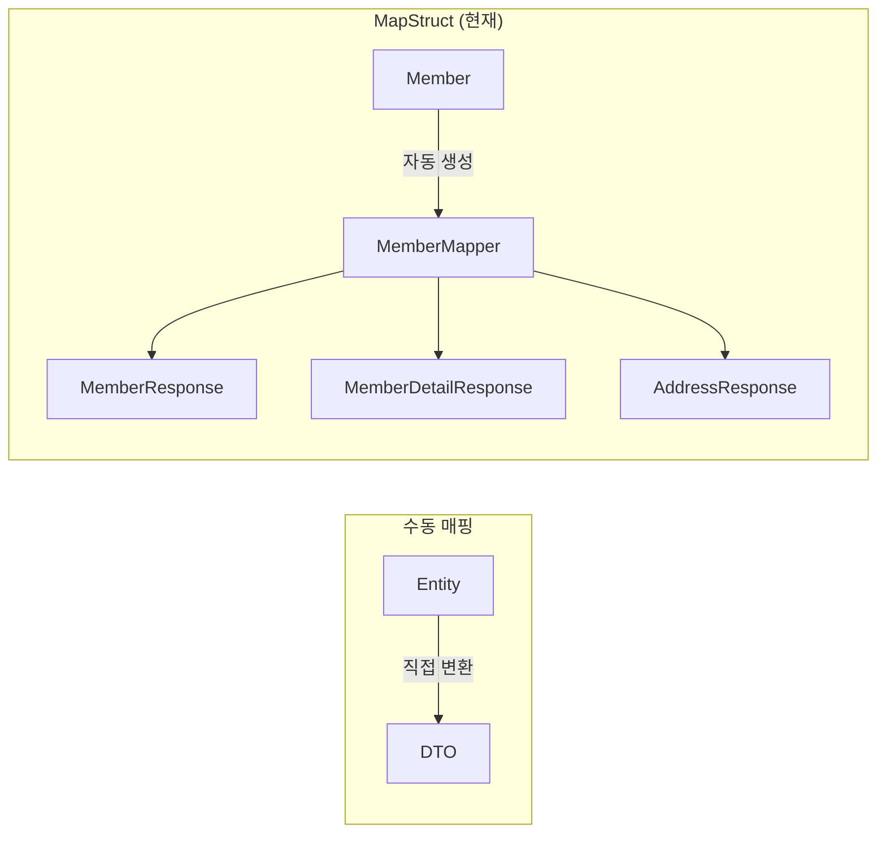

**MapStruct 장점:**
1. **컴파일 타임 검증**: 필드 누락 시 경고
2. **성능**: 리플렉션 없이 직접 메서드 호출
3. **코드 생성**: 보일러플레이트 제거

---

## 4. 보안 고려사항

### 4.1 비밀번호 보안

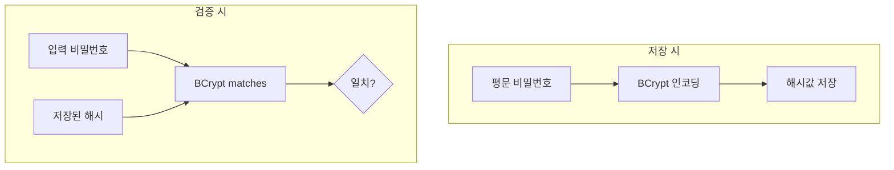

```java
// BCrypt 특징
// - Salt 자동 생성 (Rainbow Table 공격 방어)
// - 단방향 (복호화 불가)
// - 적응형 (cost factor로 연산량 조절)

passwordEncoder.encode("password123")
// 결과: $2a$10$N9qo8uLOickgx2ZMRZoMye...
//       ^^ ^^ ^^^^^^^^^^^^^^^^^^^^^^^^
//       알고 cost  salt + hash
//       리즘
```

### 4.2 이메일 중복 검증

```java
// MemberServiceImpl.java:203-207
private void validateEmailNotExists(String email) {
    if (memberRepository.existsByEmail(email)) {
        throw new DuplicateResourceException(ErrorCode.MEMBER_EMAIL_DUPLICATED);
    }
}
```

**주의사항:**
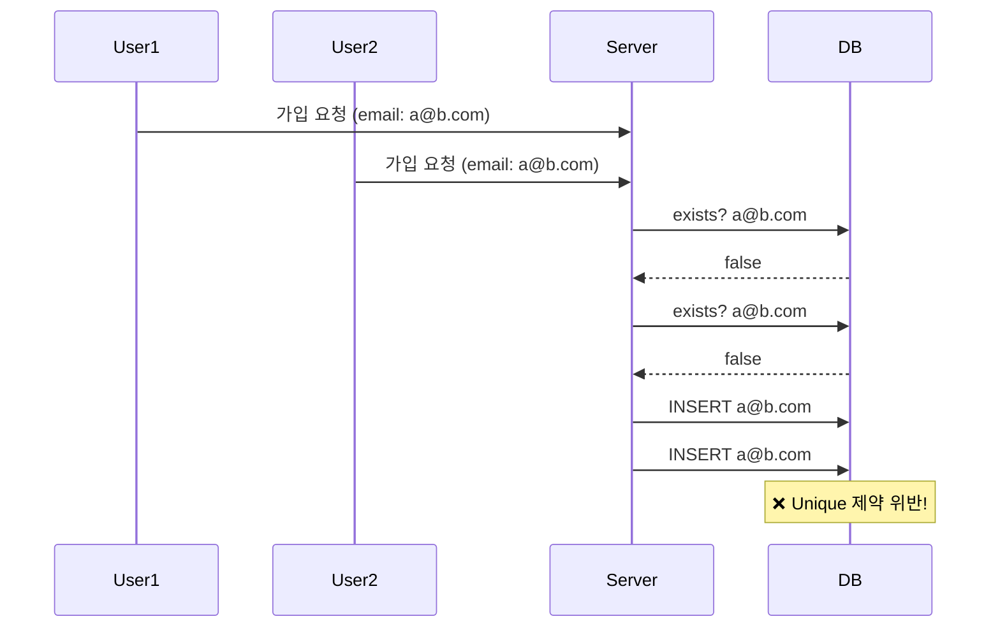

**해결책**: DB Unique 제약 + 예외 처리
```java
@Column(nullable = false, unique = true)  // Member.java:26-27
private String email;
```

---

## 5. 트레이드오프 및 대안

### 5.1 상태 관리: Enum vs State Pattern

| 항목 | Enum (현재) | State Pattern |
|------|------------|---------------|
| 복잡도 | 낮음 | 높음 |
| 상태별 행동 | switch문 | 각 상태 클래스 |
| 전이 규칙 | 조건문 | 패턴에 내장 |
| 적합한 경우 | 상태 4-5개 | 상태 10개 이상 |

```java
// 현재: Enum 기반
public boolean canLogin() {
    return this.status.canLogin() && !isDeleted();
}

// 대안: State Pattern
public interface MemberState {
    boolean canLogin();
    MemberState activate();
    MemberState suspend();
}
class ActiveState implements MemberState {
    @Override public boolean canLogin() { return true; }
}
```

### 5.2 주소 저장: Embedded vs Entity

```mermaid
graph TB
    subgraph "현재: Entity"
        M1[Member] -->|OneToMany| A1[MemberAddress]
        A1 --> DB1[(member_address 테이블)]
    end

    subgraph "대안: Embedded"
        M2[Member] -->|@ElementCollection| A2[Address]
        A2 --> DB2[(member_addresses 테이블)]
    end
```

| 항목 | Entity (현재) | @ElementCollection |
|------|--------------|-------------------|
| ID 존재 | ✅ | ❌ |
| 직접 조회 | 가능 | 불가 (부모 통해서만) |
| 성능 | JOIN 필요 | 컬렉션 전체 로딩 |
| 적합한 경우 | 독립 생명주기 | 단순 값 목록 |

### 5.3 Soft Delete 구현 방식

```mermaid
graph LR
    subgraph "현재: 수동"
        A1[Entity] --> B1[deletedAt 필드]
        B1 --> C1[쿼리에 조건 추가]
    end

    subgraph "대안: Hibernate Filter"
        A2[Entity] --> B2[@Where 어노테이션]
        B2 --> C2[자동 필터링]
    end
```

```java
// 대안: Hibernate @Where
@Entity
@Where(clause = "deleted_at IS NULL")  // 자동 필터
public class Member { ... }

// 장점: 쿼리마다 조건 추가 불필요
// 단점: 삭제된 데이터 조회 어려움
```

---

## 6. 핵심 체크포인트

### ✅ 이해도 점검

1. **왜 MemberAddress.setDefault()가 package-private인가?**
   - 기본 주소 불변식 보호 (항상 1개만 기본)
   - Member를 통해서만 변경 가능하도록 강제

2. **Soft Delete의 장점은?**
   - 데이터 복구 가능
   - 외래 키 관계 유지
   - 감사(Audit) 추적 용이

3. **BCrypt의 특징은?**
   - Salt 자동 포함 (Rainbow Table 방어)
   - 단방향 (복호화 불가)
   - Cost factor로 연산 비용 조절

4. **첫 번째 주소가 자동으로 기본이 되는 이유는?**
   - UX: 사용자 편의성 (클릭 한 번 줄임)
   - 비즈니스: 기본 주소 없는 상태 방지

5. **PENDING 상태에서 로그인이 안 되는 이유는?**
   - 이메일 인증 강제
   - 스팸 계정 방지

---

## 7. 연관 문서

- [Order 분석](./01-order-analysis.md) - 주문 시 회원 정보 활용
- [인증 시스템](../docs/auth/auth-flow.md) - JWT 기반 로그인

---

> 📝 **학습 팁**: 도메인 모델의 메서드 접근 제어자(public, package-private)를 주의 깊게 보세요. 이것이 Aggregate 경계를 보호하는 핵심입니다.
