# Product 도메인 분석 가이드

> 📚 **대상**: 인턴 엔지니어
> 🎯 **목표**: 상품 도메인의 재고 관리와 옵션 시스템 이해
> 📅 **작성일**: 2025-12-28

---

## 1. 상품 도메인 개요

### 1.1 아키텍처 개요

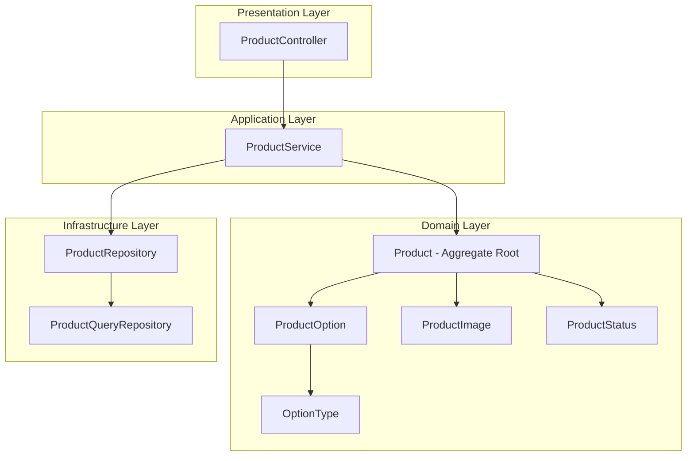

### 1.2 상품 구조 모델

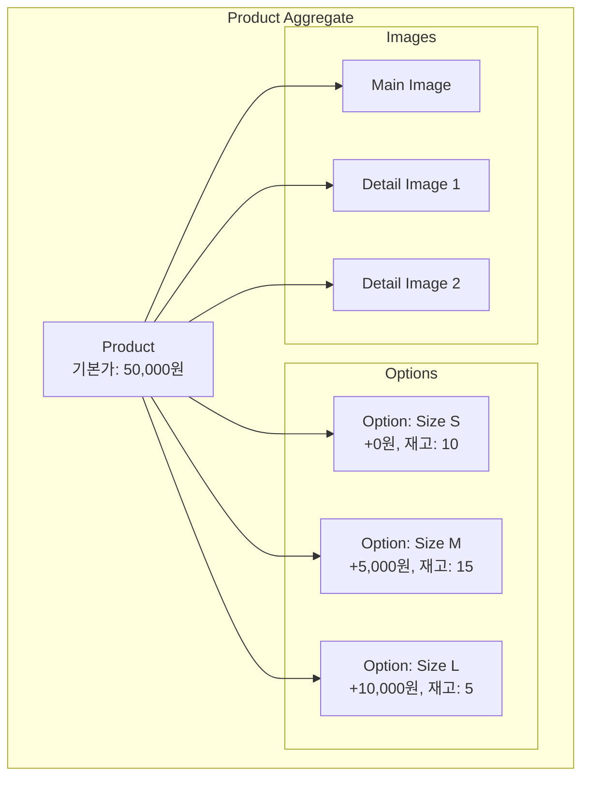

---

## 2. 도메인 모델 분석

### 2.1 Product - Aggregate Root

> **📁 파일 위치**: `src/main/java/platform/ecommerce/domain/product/Product.java`

#### 클래스 구조

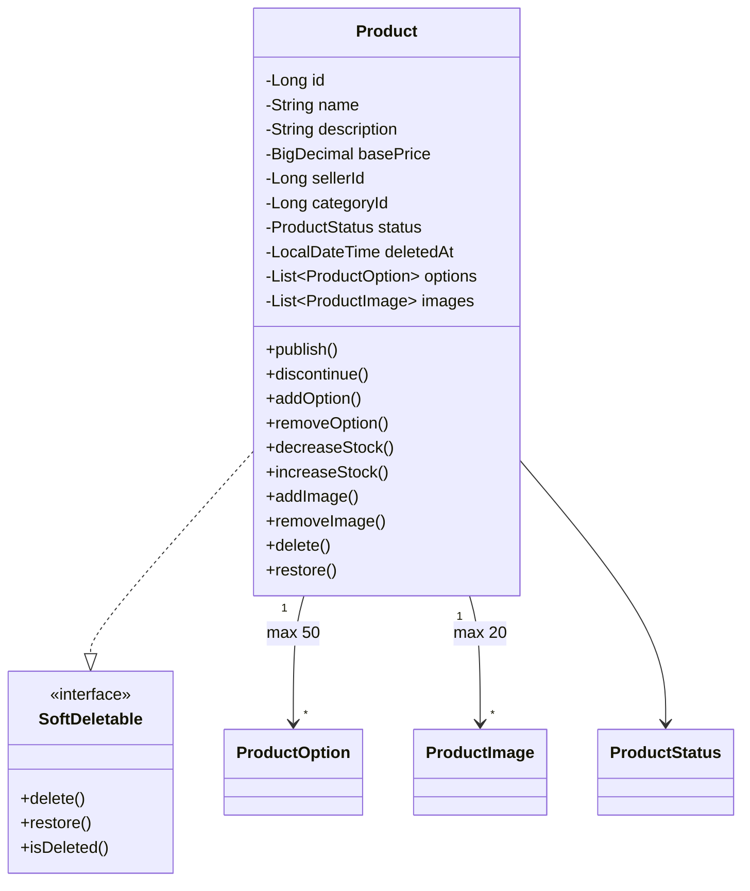

#### 필드 분석

| 라인 | 필드 | 설명 | 제약조건 |
|------|------|------|----------|
| 26-27 | MAX_OPTIONS/MAX_IMAGES | 옵션/이미지 최대 개수 | 50/20개 |
| 35-36 | basePrice | 기본 가격 | 0 이상 |
| 38-39 | sellerId | 판매자 ID | FK 참조 (느슨한 결합) |
| 51-53 | options | 상품 옵션 목록 | displayOrder 정렬 |

```java
// Product.java:51-53 - 옵션 컬렉션 설정
@OneToMany(mappedBy = "product", cascade = CascadeType.ALL, orphanRemoval = true)
@OrderBy("displayOrder ASC")  // 정렬 순서 보장
private List<ProductOption> options = new ArrayList<>();
```

#### 💡 이론: orphanRemoval vs CASCADE.REMOVE

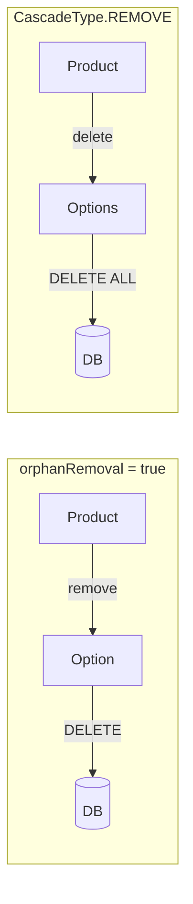

| 속성 | 동작 | 사용 시점 |
|------|------|----------|
| `orphanRemoval=true` | 부모 컬렉션에서 제거 시 삭제 | 컬렉션 요소 개별 관리 |
| `CascadeType.REMOVE` | 부모 삭제 시 자식도 삭제 | 부모-자식 동시 삭제 |

---

### 2.2 상태 전이 (ProductStatus)

> **📁 파일 위치**: `src/main/java/platform/ecommerce/domain/product/ProductStatus.java`

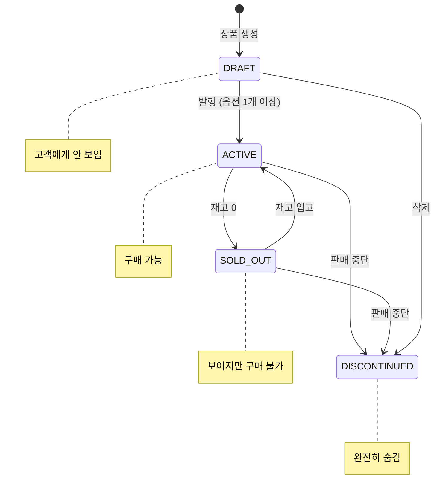

#### 상태별 행동

```java
// ProductStatus.java:22-28
public boolean canPurchase() {
    return this == ACTIVE;  // ACTIVE만 구매 가능
}

public boolean isVisible() {
    return this == ACTIVE || this == SOLD_OUT;  // 고객에게 보이는 상태
}
```

| 상태 | 구매 가능 | 고객 노출 | 용도 |
|------|----------|----------|------|
| DRAFT | ❌ | ❌ | 상품 준비 중 |
| ACTIVE | ✅ | ✅ | 정상 판매 |
| SOLD_OUT | ❌ | ✅ | 재입고 대기 (관심 상품) |
| DISCONTINUED | ❌ | ❌ | 영구 판매 중단 |

#### 자동 상태 전이 (Product.java:100-106)

```java
public void updateStatusByStock() {
    if (this.status == ProductStatus.ACTIVE && getTotalStock() == 0) {
        this.status = ProductStatus.SOLD_OUT;  // 재고 소진 → 품절
    } else if (this.status == ProductStatus.SOLD_OUT && getTotalStock() > 0) {
        this.status = ProductStatus.ACTIVE;   // 재입고 → 판매 재개
    }
}
```

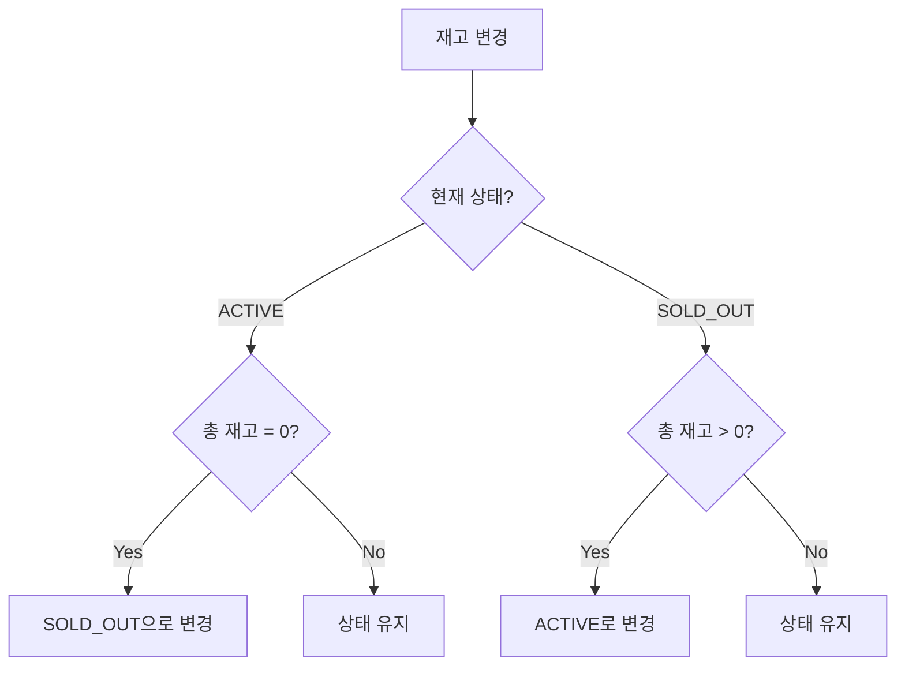

---

### 2.3 ProductOption - 옵션 관리

> **📁 파일 위치**: `src/main/java/platform/ecommerce/domain/product/ProductOption.java`

#### 옵션 구조

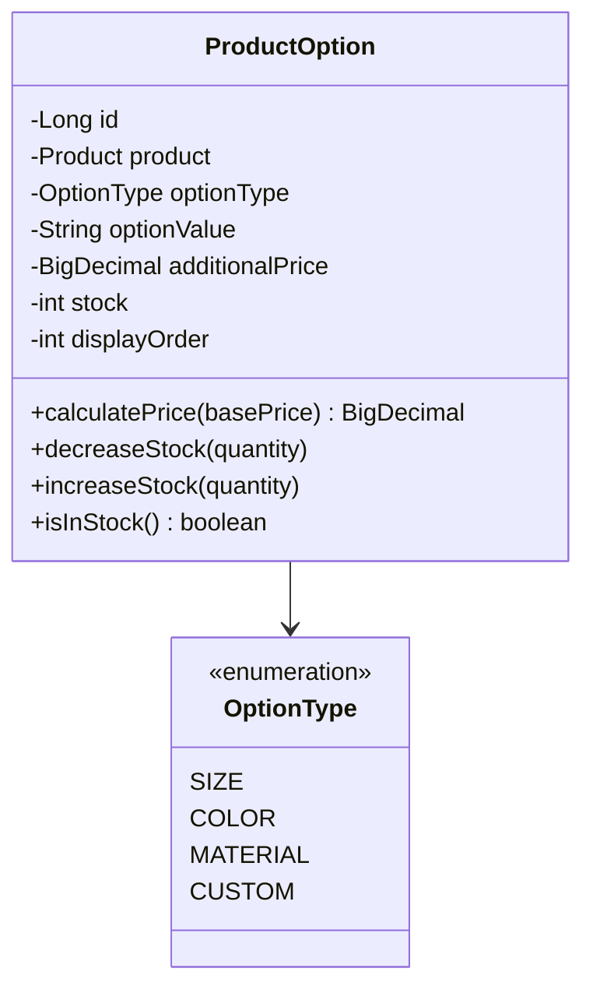

#### 재고 관리 로직 (ProductOption.java:63-75)

```java
public void decreaseStock(int quantity) {
    if (quantity > this.stock) {
        throw new InvalidStateException(ErrorCode.INSUFFICIENT_STOCK);
    }
    this.stock -= quantity;
}

public void increaseStock(int quantity) {
    this.stock += quantity;
}
```

```mermaid
sequenceDiagram
    participant Order
    participant Product
    participant Option

    Note over Order,Option: 주문 시
    Order->>Product: decreaseStock(optionId, qty)
    Product->>Option: decreaseStock(qty)
    Option->>Option: 재고 검증
    alt 재고 부족
        Option-->>Product: InvalidStateException
    else 재고 충분
        Option-->>Product: 성공
        Product->>Product: updateStatusByStock()
    end

    Note over Order,Option: 취소 시
    Order->>Product: increaseStock(optionId, qty)
    Product->>Option: increaseStock(qty)
    Product->>Product: updateStatusByStock()
```

#### 💡 이론: 가격 계산 전략

```java
// ProductOption.java:56-58
public BigDecimal calculatePrice(BigDecimal basePrice) {
    return basePrice.add(additionalPrice);  // 기본가 + 추가금
}
```

```
예시:
┌─────────────────────────────────────────────────────────┐
│  상품: 티셔츠 (기본가: 30,000원)                          │
├─────────────────────────────────────────────────────────┤
│  Size S  → 30,000 + 0     = 30,000원                    │
│  Size M  → 30,000 + 5,000 = 35,000원                    │
│  Size L  → 30,000 + 8,000 = 38,000원                    │
│  Size XL → 30,000 + 10,000 = 40,000원                   │
└─────────────────────────────────────────────────────────┘
```

**대안 비교:**

| 방식 | 설명 | 장점 | 단점 |
|------|------|------|------|
| 추가금 방식 (현재) | 기본가 + 옵션 추가금 | 유연함, 기본가 변경 쉬움 | 최종가 계산 필요 |
| 절대가 방식 | 옵션별 완전 독립 가격 | 명확함 | 기본가 변경 시 전체 수정 |
| 할인율 방식 | 기본가 × 옵션 비율 | 할인 표현 용이 | 복잡함 |

---

### 2.4 이미지 관리

> **📁 파일 위치**: `src/main/java/platform/ecommerce/domain/product/ProductImage.java`

#### 이미지 순서 관리

```java
// Product.java:248-254 - 이미지 재정렬
private void reorderImages() {
    List<ProductImage> sorted = new ArrayList<>(this.images);
    sorted.sort(Comparator.comparingInt(ProductImage::getDisplayOrder));
    for (int i = 0; i < sorted.size(); i++) {
        sorted.get(i).updateOrder(i);  // 순서 재할당
    }
}
```

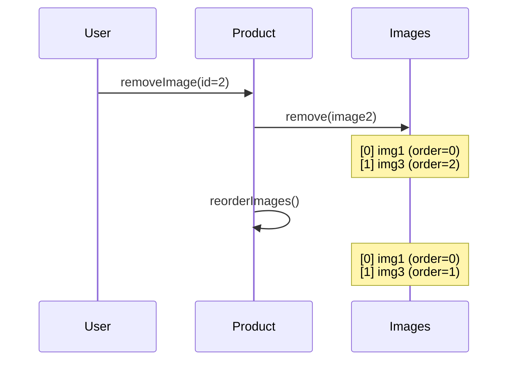

---

## 3. 재고 관리 심화

### 3.1 재고 흐름

```mermaid
flowchart TD
    subgraph "재고 감소"
        A1[주문 생성] --> B1[Product.decreaseStock]
        B1 --> C1[Option.decreaseStock]
        C1 --> D1[updateStatusByStock]
    end

    subgraph "재고 증가"
        A2[주문 취소] --> B2[Product.increaseStock]
        B2 --> C2[Option.increaseStock]
        C2 --> D2[updateStatusByStock]
    end

    subgraph "직접 수정"
        A3[관리자] --> B3[Option.updateStock]
        B3 --> C3[Product.updateStatusByStock]
    end
```

### 3.2 동시성 이슈와 해결책

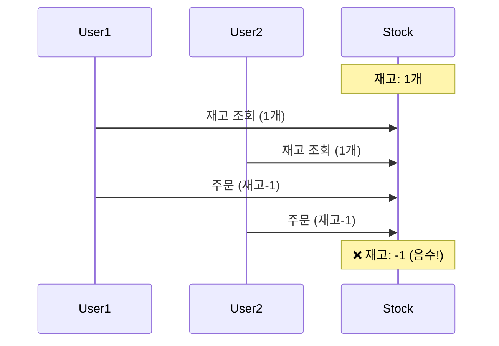

**해결책:**

| 방법 | 설명 | 장점 | 단점 |
|------|------|------|------|
| **비관적 락** | `SELECT ... FOR UPDATE` | 확실한 보장 | 성능 저하 |
| **낙관적 락** | `@Version` 필드 | 성능 좋음 | 충돌 시 재시도 |
| **분산 락** | Redis Lock | 분산 환경 | 복잡성 증가 |
| **DB 제약** | `CHECK (stock >= 0)` | 최후 방어선 | 예외 처리 필요 |

```java
// 현재 구현: 비즈니스 검증
public void decreaseStock(int quantity) {
    if (quantity > this.stock) {  // 검증
        throw new InvalidStateException(ErrorCode.INSUFFICIENT_STOCK);
    }
    this.stock -= quantity;
}

// 권장: @Version 추가
@Version
private Long version;
```

---

## 4. 발행 규칙 (Business Rules)

### 4.1 상품 발행 조건

```java
// Product.java:77-85
public void publish() {
    if (this.status != ProductStatus.DRAFT) {
        throw new InvalidStateException(ErrorCode.PRODUCT_NOT_AVAILABLE,
            "Only draft products can be published");  // DRAFT만 발행 가능
    }
    if (this.options.isEmpty()) {
        throw new InvalidStateException(ErrorCode.PRODUCT_NOT_AVAILABLE,
            "Product must have at least one option");  // 옵션 1개 이상 필수
    }
    this.status = ProductStatus.ACTIVE;
}
```

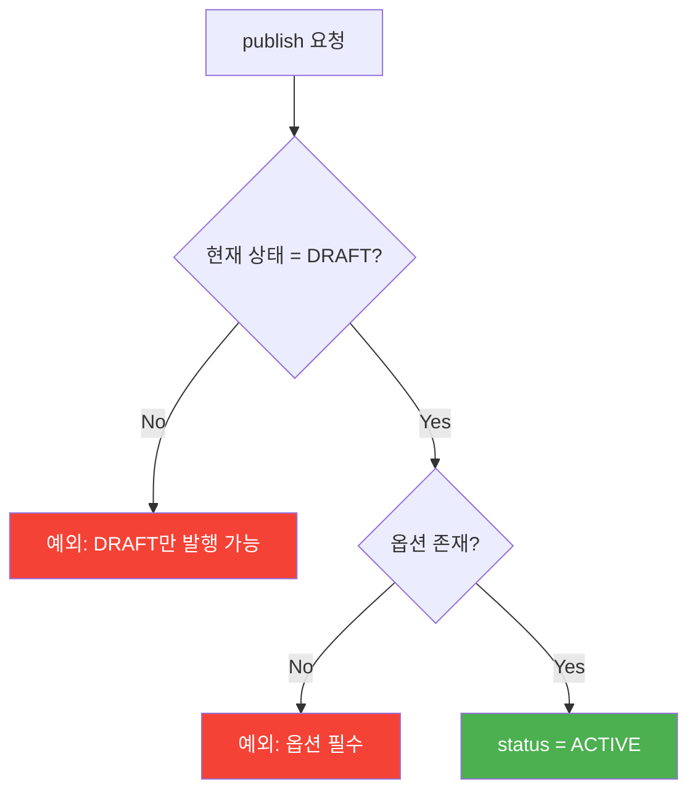

### 4.2 불변식 (Invariants)

```
┌─────────────────────────────────────────────────────────────┐
│                 Product 불변식                               │
├─────────────────────────────────────────────────────────────┤
│                                                              │
│  1. basePrice >= 0                                          │
│  2. options.size() <= 50                                    │
│  3. images.size() <= 20                                     │
│  4. ACTIVE 상품은 최소 1개 이상의 옵션 보유                   │
│  5. option.stock >= 0                                       │
│  6. ACTIVE이고 totalStock = 0이면 → SOLD_OUT으로 전이        │
│                                                              │
└─────────────────────────────────────────────────────────────┘
```

---

## 5. 트레이드오프 및 대안

### 5.1 옵션 설계 방식

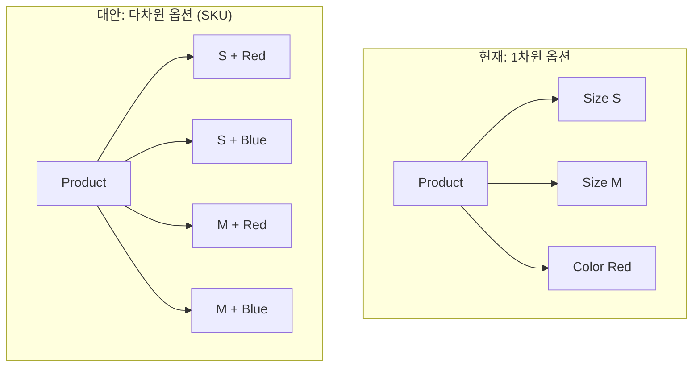

| 방식 | 설명 | 장점 | 단점 |
|------|------|------|------|
| 1차원 (현재) | 옵션 하나만 선택 | 단순함 | 조합 표현 불가 |
| 다차원 (SKU) | 옵션 조합 = SKU | 정확한 재고 관리 | 복잡성 (2×3=6개 SKU) |

### 5.2 재고 관리 전략

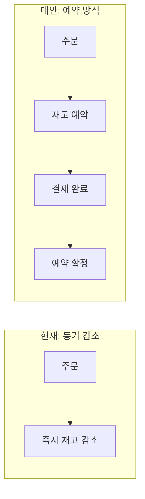

| 방식 | 동작 | 장점 | 단점 |
|------|------|------|------|
| 즉시 감소 (현재) | 주문 시 바로 감소 | 단순함 | 취소 시 복원 필요 |
| 예약 방식 | 결제 완료 시 확정 | 정확함 | 구현 복잡 |
| 초과 판매 허용 | 재고 0 이하 허용 | 판매 극대화 | 백오더 관리 필요 |

---

## 6. 핵심 체크포인트

### ✅ 이해도 점검

1. **왜 옵션에 additionalPrice를 사용하는가?**
   - 기본가 변경 시 모든 옵션 자동 반영
   - 옵션별 가격 차이만 관리

2. **상품 발행 시 옵션이 필수인 이유는?**
   - 재고는 옵션 단위로 관리
   - 옵션 없으면 구매 수량 추적 불가

3. **orphanRemoval=true의 역할은?**
   - 컬렉션에서 제거된 요소 자동 DELETE
   - 부모-자식 생명주기 동기화

4. **updateStatusByStock()이 필요한 이유는?**
   - 재고 변화에 따른 상태 자동 전이
   - ACTIVE ↔ SOLD_OUT 자동 관리

5. **displayOrder 필드가 필요한 이유는?**
   - 옵션/이미지 표시 순서 보장
   - `@OrderBy`와 함께 정렬 일관성 유지

---

## 7. 연관 문서

- [Order 분석](./01-order-analysis.md) - 주문 시 재고 감소 흐름
- [Cart 분석](./05-cart-analysis.md) - 장바구니와 상품 연동

---

> 📝 **학습 팁**: 상품 도메인은 "재고"가 핵심입니다. 동시성 문제와 상태 일관성을 항상 고려하세요.
