# Cart 도메인 분석 가이드

> 📚 **대상**: 인턴 엔지니어
> 🎯 **목표**: 장바구니 시스템의 설계 패턴과 상품 연동 이해
> 📅 **작성일**: 2025-12-28

---

## 1. 장바구니 도메인 개요

### 1.1 아키텍처 개요

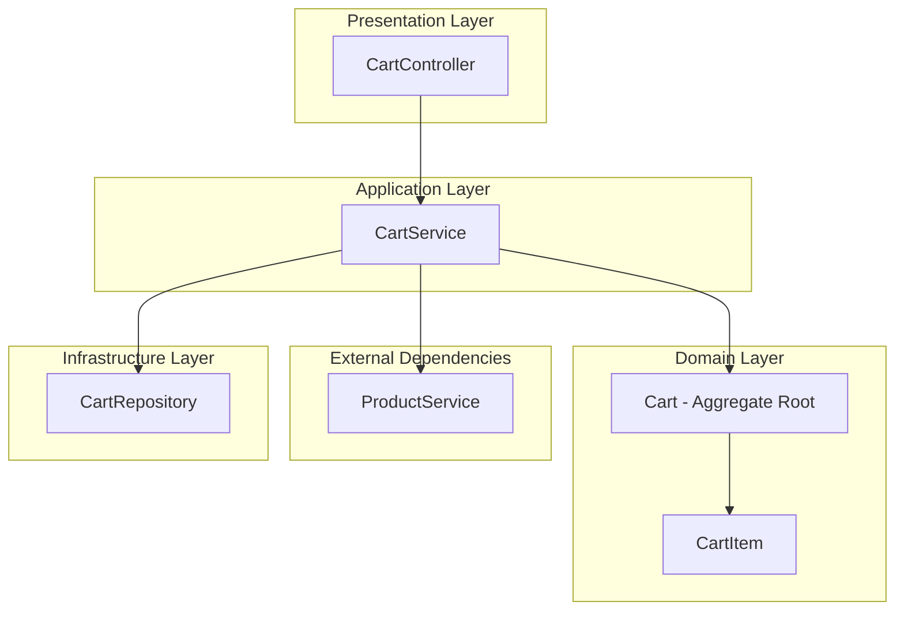

### 1.2 장바구니 구조

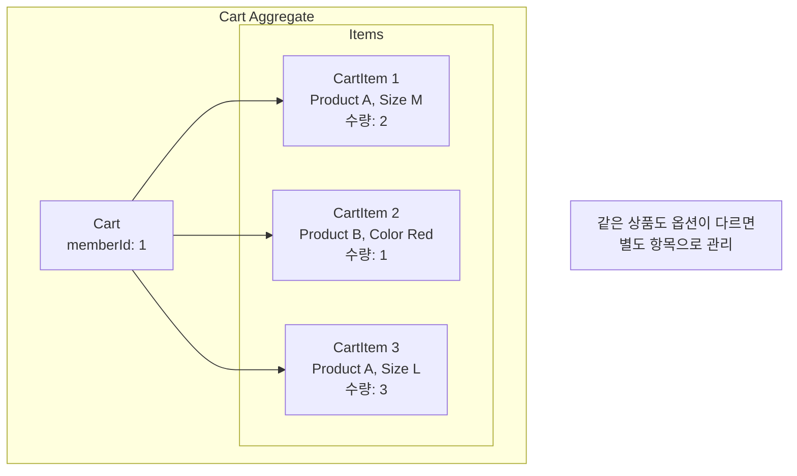

---

## 2. 도메인 모델 분석

### 2.1 Cart - Aggregate Root

> **📁 파일 위치**: `src/main/java/platform/ecommerce/domain/cart/Cart.java`

#### 클래스 구조

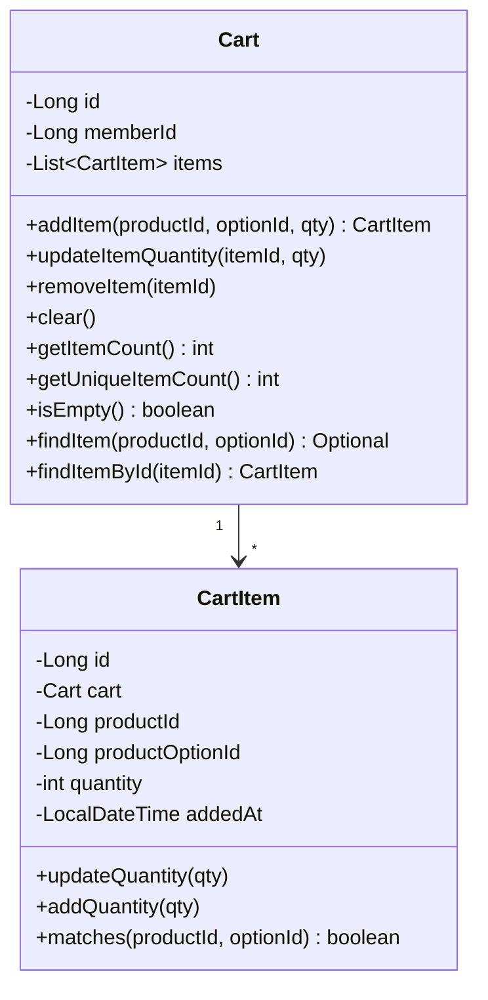

#### 핵심 필드 분석

| 라인 | 필드 | 설명 | 제약조건 |
|------|------|------|----------|
| 23-24 | memberId | 회원 ID | unique (1인 1카트) |
| 26-27 | items | 장바구니 항목 | orphanRemoval=true |

```java
// Cart.java:23-24 - 1인 1카트 제약
@Column(name = "member_id", nullable = false, unique = true)
private Long memberId;
```

#### 💡 이론: 1인 1카트 vs 다중 카트

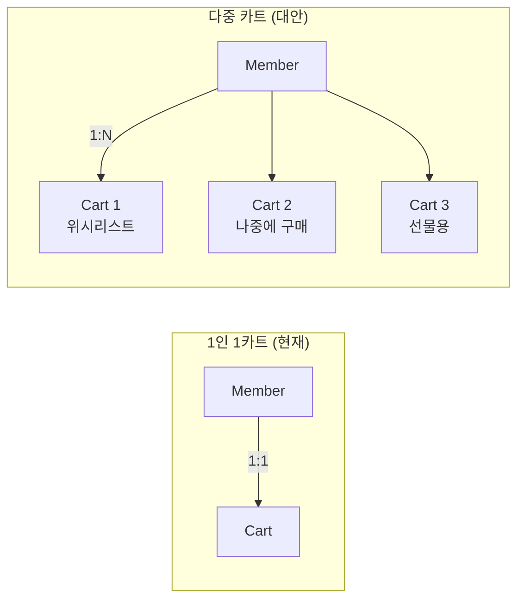

| 방식 | 장점 | 단점 | 사용 예시 |
|------|------|------|----------|
| 1인 1카트 | 단순함 | 기능 제한 | 일반 쇼핑몰 |
| 다중 카트 | 유연함 | 복잡성 증가 | 아마존 (위시리스트) |

---

### 2.2 아이템 병합 로직

> **📁 파일 위치**: `src/main/java/platform/ecommerce/domain/cart/Cart.java:37-54`

```java
public CartItem addItem(Long productId, Long productOptionId, int quantity) {
    // 1. 동일 상품+옵션 검색
    Optional<CartItem> existingItem = findItem(productId, productOptionId);

    if (existingItem.isPresent()) {
        // 2. 기존 항목에 수량 추가
        existingItem.get().addQuantity(quantity);
        return existingItem.get();
    }

    // 3. 새 항목 생성
    CartItem newItem = CartItem.builder()
            .cart(this)
            .productId(productId)
            .productOptionId(productOptionId)
            .quantity(quantity)
            .build();

    this.items.add(newItem);
    return newItem;
}
```

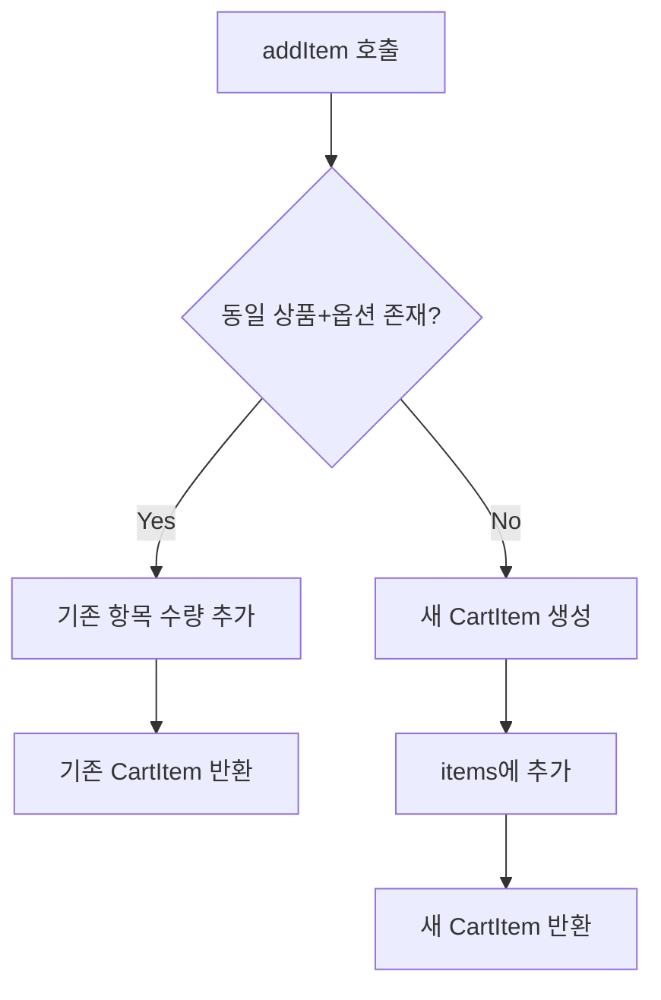

#### 왜 병합하는가?

```
시나리오:
1. 사용자가 "티셔츠 M 사이즈" 1개 추가
2. 다른 페이지에서 같은 상품 2개 추가

❌ 병합 안 함:
├── CartItem 1: 티셔츠 M, 수량 1
└── CartItem 2: 티셔츠 M, 수량 2  ← 중복!

✅ 병합 (현재):
└── CartItem 1: 티셔츠 M, 수량 3  ← 통합!
```

---

### 2.3 CartItem - 수량 관리

> **📁 파일 위치**: `src/main/java/platform/ecommerce/domain/cart/CartItem.java`

#### Unique 제약조건

```java
// CartItem.java:15-17 - 복합 유니크 제약
@Entity
@Table(name = "cart_item", uniqueConstraints = {
    @UniqueConstraint(columnNames = {"cart_id", "product_id", "product_option_id"})
})
```

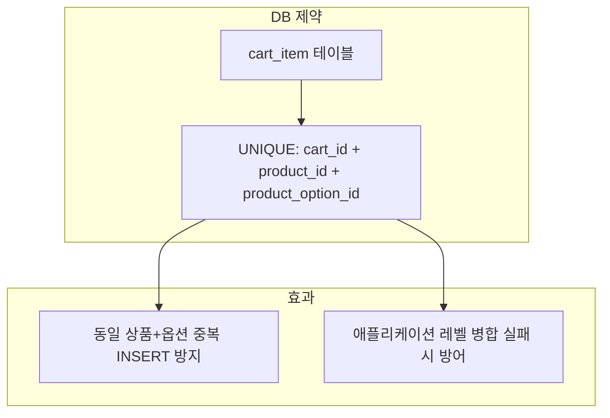

#### 수량 검증 (CartItem.java:80-87)

```java
private void validateQuantity(int quantity) {
    if (quantity <= 0) {
        throw new IllegalArgumentException("Quantity must be positive");
    }
    if (quantity > MAX_QUANTITY) {  // MAX_QUANTITY = 99
        throw new IllegalArgumentException("Quantity cannot exceed " + MAX_QUANTITY);
    }
}
```

| 검증 | 목적 | 실패 시 |
|------|------|---------|
| `quantity <= 0` | 유효한 수량 보장 | IllegalArgumentException |
| `quantity > 99` | 과도한 수량 방지 | IllegalArgumentException |

---

### 2.4 상품-옵션 매칭 로직

> **📁 파일 위치**: `src/main/java/platform/ecommerce/domain/cart/CartItem.java:70-78`

```java
public boolean matches(Long productId, Long productOptionId) {
    if (!this.productId.equals(productId)) {
        return false;  // 상품 ID 불일치
    }
    if (this.productOptionId == null && productOptionId == null) {
        return true;   // 둘 다 옵션 없음 → 일치
    }
    return this.productOptionId != null && this.productOptionId.equals(productOptionId);
}
```

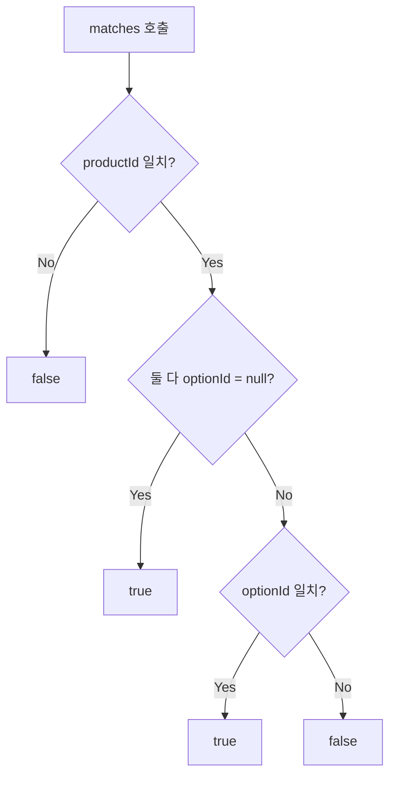

**NULL 처리 시나리오:**

| 기존 optionId | 요청 optionId | 결과 | 설명 |
|---------------|---------------|------|------|
| null | null | true | 옵션 없는 상품 |
| null | 1 | false | 다른 상품 |
| 1 | null | false | 다른 상품 |
| 1 | 1 | true | 같은 옵션 |
| 1 | 2 | false | 다른 옵션 |

---

## 3. 서비스 레이어 분석

> **📁 파일 위치**: `src/main/java/platform/ecommerce/service/cart/CartServiceImpl.java`

### 3.1 장바구니 자동 생성 패턴

```java
// CartServiceImpl.java:34-40
@Override
@Transactional
public CartResponse getOrCreateCart(Long memberId) {
    Cart cart = cartRepository.findByMemberIdWithItems(memberId)
            .orElseGet(() -> createCart(memberId));  // 없으면 생성
    return toResponse(cart);
}
```

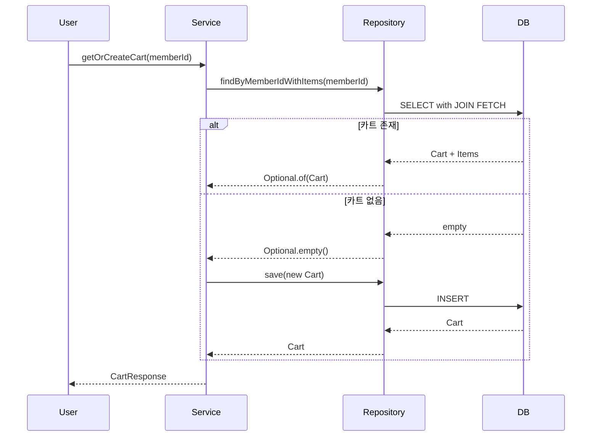

### 3.2 상품 유효성 검증

```java
// CartServiceImpl.java:44-56
@Override
@Transactional
public CartItemResponse addToCart(Long memberId, CartItemAddRequest request) {
    // 상품 존재 및 판매 가능 여부 확인
    ProductDetailResponse product = productService.getProductDetail(request.productId());
    validateProductAvailable(product, request.productOptionId());

    Cart cart = getOrCreateCartEntity(memberId);
    CartItem item = cart.addItem(request.productId(), request.productOptionId(), request.quantity());

    return toItemResponse(item, product);
}
```

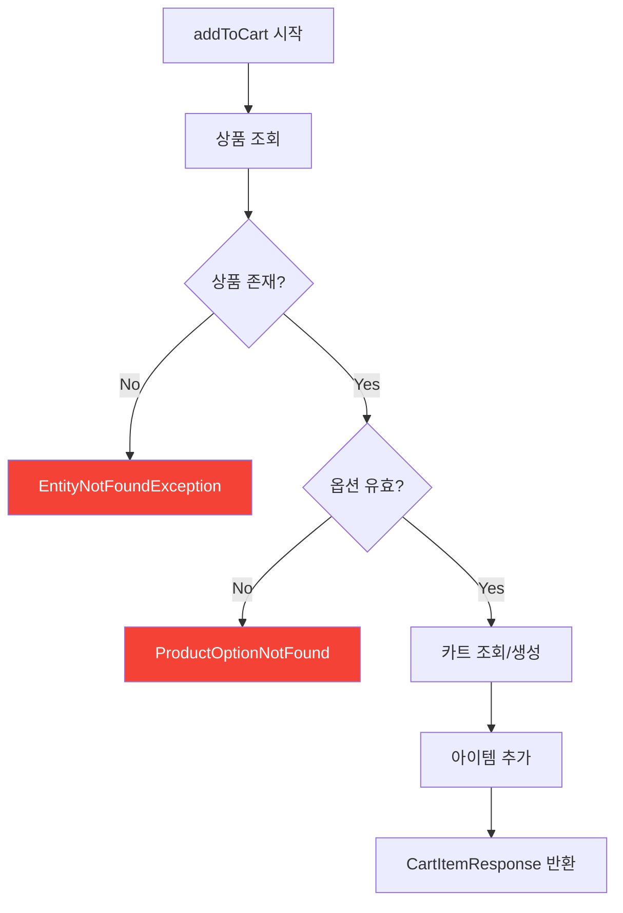

### 3.3 삭제된 상품 처리

```java
// CartServiceImpl.java:174-192 - 삭제된 상품 우아하게 처리
private CartItemResponse toItemResponseWithProduct(CartItem item) {
    try {
        ProductDetailResponse product = productService.getProductDetail(item.getProductId());
        return toItemResponse(item, product);
    } catch (EntityNotFoundException e) {
        // 상품이 더 이상 존재하지 않음 → 비활성화 표시
        return CartItemResponse.builder()
                .id(item.getId())
                .productId(item.getProductId())
                .productName("Product unavailable")  // ⚠️ 사용 불가 표시
                .quantity(item.getQuantity())
                .unitPrice(BigDecimal.ZERO)
                .available(false)  // 구매 불가
                .addedAt(item.getAddedAt())
                .build();
    }
}
```

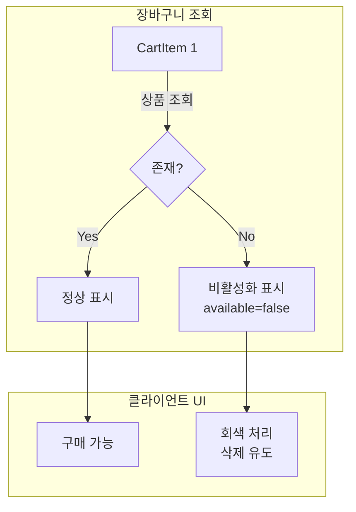

**장점:**
- 장바구니 전체 조회 실패 방지
- 사용자에게 명확한 피드백 제공
- 상품 삭제가 장바구니에 영향 X

---

## 4. 가격 계산 로직

### 4.1 실시간 가격 조회

```java
// CartServiceImpl.java:194-223
private CartItemResponse toItemResponse(CartItem item, ProductDetailResponse product) {
    String optionName = null;
    BigDecimal unitPrice = product.basePrice();  // 기본가

    if (item.getProductOptionId() != null) {
        ProductOptionResponse option = product.options().stream()
                .filter(opt -> opt.id().equals(item.getProductOptionId()))
                .findFirst()
                .orElse(null);

        if (option != null) {
            optionName = option.optionValue();
            unitPrice = product.basePrice().add(option.additionalPrice());  // 기본가 + 추가금
        }
    }

    BigDecimal subtotal = unitPrice.multiply(BigDecimal.valueOf(item.getQuantity()));

    return CartItemResponse.builder()
            .unitPrice(unitPrice)
            .quantity(item.getQuantity())
            .subtotal(subtotal)
            .build();
}
```

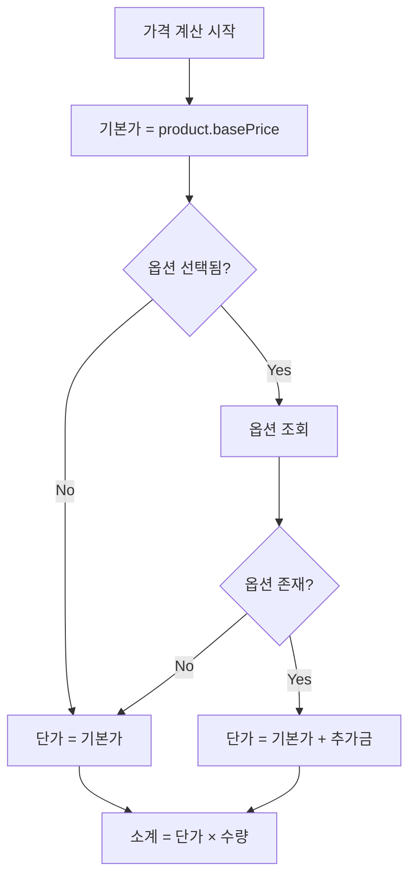

### 4.2 장바구니 합계 계산

```java
// CartServiceImpl.java:149-160
private CartResponse toResponseWithProductDetails(Cart cart) {
    List<CartItemResponse> items = cart.getItems().stream()
            .map(this::toItemResponseWithProduct)
            .toList();

    BigDecimal subtotal = items.stream()
            .map(CartItemResponse::subtotal)  // 각 항목 소계
            .reduce(BigDecimal.ZERO, BigDecimal::add);  // 합계

    return CartResponse.builder()
            .items(items)
            .subtotal(subtotal)
            .build();
}
```

```
장바구니 예시:
┌─────────────────────────────────────────────────────────┐
│  Item 1: 티셔츠 M (30,000 + 5,000) × 2 = 70,000원        │
│  Item 2: 청바지 L (50,000 + 8,000) × 1 = 58,000원        │
│  Item 3: 양말     (5,000 + 0) × 3     = 15,000원         │
├─────────────────────────────────────────────────────────┤
│  소계: 143,000원                                         │
│  배송비: 3,000원 (주문 시 계산)                           │
│  할인: -10,000원 (주문 시 계산)                           │
│  총액: 136,000원 (주문 시 계산)                           │
└─────────────────────────────────────────────────────────┘
```

---

## 5. 트레이드오프 및 대안

### 5.1 가격 저장 방식

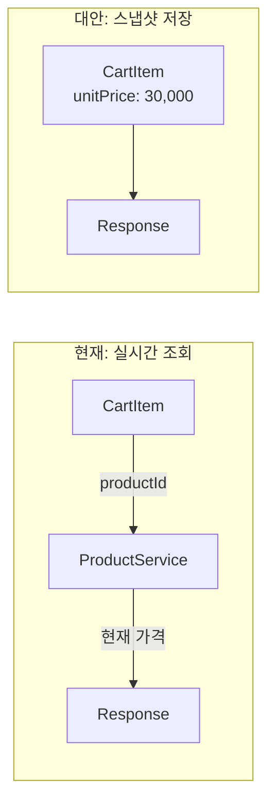

| 방식 | 장점 | 단점 | 사용 시점 |
|------|------|------|----------|
| 실시간 조회 (현재) | 항상 최신 가격 | 상품 조회 필요 | 가격 변동 반영 필요 |
| 스냅샷 저장 | 빠른 조회 | 가격 동기화 필요 | 성능 우선 |

### 5.2 장바구니 저장소

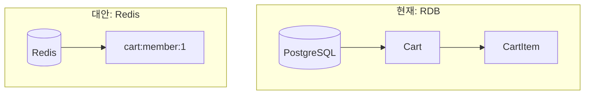

| 방식 | 장점 | 단점 | 사용 시점 |
|------|------|------|----------|
| RDB (현재) | 영속성, 관계 | 상대적 느림 | 데이터 중요 |
| Redis | 매우 빠름 | 휘발성 | 성능 우선 |
| 하이브리드 | 균형 | 복잡함 | 대규모 서비스 |

### 5.3 장바구니 ↔ 주문 변환

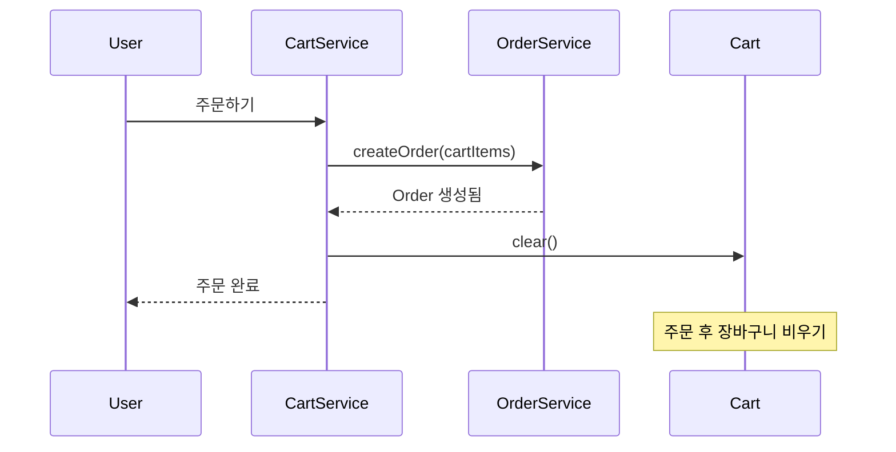

---

## 6. 핵심 체크포인트

### ✅ 이해도 점검

1. **왜 동일 상품+옵션을 병합하는가?**
   - UX: 같은 상품이 여러 줄로 표시되면 혼란
   - 데이터: 중복 레코드 방지

2. **CartItem에 가격을 저장하지 않는 이유는?**
   - 실시간 가격 반영 (할인, 가격 변경)
   - 장바구니는 "담아둔 상태"이므로 최신 가격 표시

3. **Unique 제약조건이 필요한 이유는?**
   - 애플리케이션 버그 방어선
   - 동시성 문제 최종 방어

4. **삭제된 상품을 예외 없이 처리하는 이유는?**
   - 장바구니 전체 조회 실패 방지
   - 사용자에게 명확한 피드백 제공

5. **memberId에 unique 제약이 있는 이유는?**
   - 1인 1카트 정책 강제
   - 중복 카트 생성 방지

---

## 7. 연관 문서

- [Product 분석](./04-product-analysis.md) - 상품 가격 계산
- [Order 분석](./01-order-analysis.md) - 장바구니 → 주문 전환

---

> 📝 **학습 팁**: 장바구니는 "임시 저장소"입니다. 주문과 달리 가격을 스냅샷하지 않는 이유를 이해하세요.
